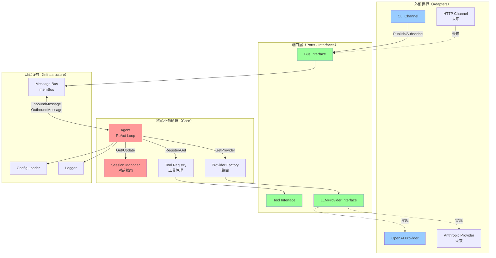

# 01 - 架构总览

本文档介绍 unlimitedClaw 的整体架构设计，帮助您建立全局视角，理解各个组件之间的关系和职责划分。

## 目录

- [六边形架构原理](#六边形架构原理)
- [项目目录结构](#项目目录结构)
- [核心包职责](#核心包职责)
- [依赖注入模式](#依赖注入模式)
- [与 PicoClaw 的架构对比](#与-picoclaw-的架构对比)
- [系统架构图](#系统架构图)

## 六边形架构原理

unlimitedClaw 采用**六边形架构**（Hexagonal Architecture），也称为**端口和适配器架构**（Ports and Adapters）。这是一种将业务逻辑与外部依赖隔离的架构模式。

### 核心思想

```
外部世界 → 适配器 → 端口（接口） → 核心业务逻辑
```

- **核心（Core）**：业务逻辑不依赖任何外部系统
- **端口（Ports）**：定义核心与外部交互的接口契约
- **适配器（Adapters）**：实现端口，连接外部系统（数据库、API、CLI 等）

### 优势

1. **可测试性**：核心逻辑可以使用 Mock 适配器进行独立测试
2. **可替换性**：可以轻松替换外部系统（如切换 LLM 提供商）
3. **关注点分离**：业务逻辑与技术细节解耦
4. **延迟决策**：可以推迟技术选型决策，先专注核心逻辑

### 在 unlimitedClaw 中的体现

| 层次 | 组件 | 说明 |
|------|------|------|
| **核心** | `pkg/agent/` | ReAct 循环业务逻辑 |
| **核心** | `pkg/session/` | 会话状态管理 |
| **端口** | `bus.Bus` 接口 | 消息传递契约 |
| **端口** | `tools.Tool` 接口 | 工具能力契约 |
| **端口** | `providers.LLMProvider` 接口 | LLM 调用契约 |
| **适配器** | `pkg/bus/memBus` | 内存消息总线实现 |
| **适配器** | `pkg/channels/cli/` | CLI 输入输出适配器 |
| **适配器** | `pkg/providers/openai/` | OpenAI API 适配器 |

## 项目目录结构

```
unlimitedClaw/
├── cmd/
│   └── unlimitedclaw/        # 组合根（Composition Root）
│       └── main.go           # 应用程序入口，组装所有依赖
│
├── pkg/                      # 公共包（对外暴露的 API）
│   ├── agent/                # Agent ReAct 循环核心
│   │   └── agent.go          # Agent 主逻辑
│   │
│   ├── bus/                  # 消息总线
│   │   ├── bus.go            # Bus 接口和内存实现
│   │   └── message.go        # InboundMessage、OutboundMessage 定义
│   │
│   ├── tools/                # 工具系统
│   │   ├── tool.go           # Tool 接口和 ToolResult
│   │   ├── registry.go       # 工具注册表（线程安全）
│   │   └── mock.go           # Mock 工具（用于测试）
│   │
│   ├── providers/            # LLM 提供商抽象
│   │   ├── types.go          # LLMProvider 接口、Message、ToolCall
│   │   ├── factory.go        # Provider 工厂（路由到具体实现）
│   │   └── mock.go           # Mock Provider（用于测试）
│   │
│   ├── session/              # 会话管理
│   │   ├── session.go        # Session 结构（消息历史）
│   │   ├── store.go          # SessionStore 接口和内存实现
│   │   └── history.go        # HistoryManager（会话持久化）
│   │
│   ├── channels/             # I/O 适配器（输入输出通道）
│   │   └── cli/              # 命令行接口适配器
│   │       └── cli.go        # CLI 读取用户输入，发送到 bus
│   │
│   ├── config/               # 配置管理
│   │   └── config.go         # 配置结构和加载逻辑
│   │
│   └── logger/               # 结构化日志
│       └── logger.go         # Logger 接口和实现
│
├── internal/                 # 内部包（仅供本项目使用）
│
├── config/                   # 配置文件目录
│   ├── config.example.json   # 配置模板
│   └── secrets/              # 敏感配置（不入 git）
│
├── docs/
│   └── study/                # 学习文档（本指南）
│
├── scripts/                  # 构建和工具脚本
├── docker/                   # Docker 配置
├── k8s/                      # Kubernetes 配置
├── build/                    # 构建输出目录
├── go.mod                    # Go 模块定义
└── Makefile                  # 构建任务
```

## 核心包职责

### 1. `cmd/unlimitedclaw/` - 组合根

**职责**：应用程序入口点，负责组装所有依赖并启动系统。

```go
// main.go 的典型结构
func main() {
    // 1. 加载配置
    cfg := config.Load()
    
    // 2. 创建基础设施
    logger := logger.New()
    bus := bus.New()
    
    // 3. 创建工具注册表
    registry := tools.NewRegistry()
    registry.Register(...)
    
    // 4. 创建 Provider 工厂
    factory := providers.NewFactory()
    factory.Register("openai", openaiProvider)
    
    // 5. 创建会话管理
    store := session.NewMemoryStore()
    history := session.NewHistoryManager()
    
    // 6. 创建 Agent（注入所有依赖）
    agent := agent.New(bus, registry, factory, store, history, logger, cfg)
    
    // 7. 创建 CLI 通道
    cli := cli.New(bus, logger)
    
    // 8. 启动所有组件
    go agent.Start(ctx)
    go cli.Start(ctx)
    
    // 9. 等待退出信号
    <-ctx.Done()
}
```

**设计原则**：所有依赖在这里创建和注入，其他包不直接创建依赖。

### 2. `pkg/agent/` - ReAct 循环核心

**职责**：实现 AI 的推理-行动循环（Reason-Act Loop）。

**核心流程**：
1. 监听 `inbound` 主题的消息（用户输入）
2. 获取或创建会话
3. 将消息添加到会话历史
4. 调用 LLM（附带工具定义）
5. 如果 LLM 返回文本 → 发布到 `outbound` 主题，结束
6. 如果 LLM 返回工具调用 → 执行工具 → 将结果添加到历史 → 回到步骤 4
7. 最大迭代次数保护（防止无限循环）

**关键代码**（参见 `pkg/agent/agent.go`）：

```go
type Agent struct {
    bus               bus.Bus
    toolRegistry      *tools.Registry
    providerFactory   *providers.Factory
    sessionStore      session.SessionStore
    historyManager    *session.HistoryManager
    logger            logger.Logger
    config            *config.Config
    systemPrompt      string
    maxToolIterations int
}
```

### 3. `pkg/bus/` - 消息总线

**职责**：基于 Pub/Sub 模式的事件总线，解耦组件间通信。

**接口定义**（参见 `pkg/bus/bus.go` 第 6-11 行）：

```go
type Bus interface {
    Publish(topic string, msg interface{})
    Subscribe(topic string) <-chan interface{}
    Unsubscribe(topic string, ch <-chan interface{})
    Close()
}
```

**消息类型**（参见 `pkg/bus/message.go`）：
- `InboundMessage`：进入系统的消息（用户输入）
- `OutboundMessage`：离开系统的消息（AI 响应）

**实现细节**：
- 线程安全（使用 `sync.RWMutex`）
- 非阻塞发布（使用 `select`）
- 缓冲通道（容量 100）

### 4. `pkg/tools/` - 工具系统

**职责**：定义工具接口、工具注册表、工具执行结果。

**核心接口**（参见 `pkg/tools/tool.go` 第 6-11 行）：

```go
type Tool interface {
    Name() string
    Description() string
    Parameters() []ToolParameter
    Execute(ctx context.Context, args map[string]interface{}) (*ToolResult, error)
}
```

**双通道结果**（参见 `pkg/tools/tool.go` 第 24-29 行）：

```go
type ToolResult struct {
    ForLLM  string // 总是发送给 LLM 作为上下文
    ForUser string // 立即显示给用户（可为空）
    IsError bool   // 指示工具执行失败
    Silent  bool   // 如果为 true，即使 ForUser 非空也不显示
}
```

**工具注册表**：
- 线程安全的工具管理（`sync.RWMutex`）
- **按字母顺序返回工具**（参见 `pkg/tools/registry.go` 第 47-66 行）
- 原因：保持工具顺序一致，LLM 可以重用 KV 缓存，提升性能

### 5. `pkg/providers/` - LLM 提供商抽象

**职责**：定义 LLM 调用接口，支持多种提供商（OpenAI、Anthropic 等）。

**核心接口**（参见 `pkg/providers/types.go` 第 58-67 行）：

```go
type LLMProvider interface {
    Chat(ctx context.Context, messages []Message, toolDefs []tools.ToolDefinition, 
         model string, opts *ChatOptions) (*LLMResponse, error)
    Name() string
}
```

**工厂模式**（参见 `pkg/providers/factory.go`）：
- 根据模型名称路由到具体 Provider
- 例如：`"openai/gpt-4"` → 提取 `"openai"` → 返回 OpenAI Provider
- 支持动态注册新的 Provider

### 6. `pkg/session/` - 会话管理

**职责**：管理对话历史和会话状态。

**Session 结构**（参见 `pkg/session/session.go` 第 11-17 行）：

```go
type Session struct {
    ID        string
    Messages  []providers.Message
    CreatedAt time.Time
    UpdatedAt time.Time
    mu        sync.RWMutex
}
```

**线程安全操作**：
- `AddMessage()`：添加消息到历史
- `GetMessages()`：返回消息副本（防止并发修改）
- `MessageCount()`：获取消息数量

### 7. `pkg/channels/` - I/O 适配器

**职责**：连接外部 I/O 系统（CLI、HTTP、WebSocket 等）。

**当前实现**：
- `channels/cli/`：命令行接口
  - 读取用户输入
  - 发布 `InboundMessage` 到总线
  - 订阅 `OutboundMessage`，打印到终端

**未来扩展**：
- `channels/http/`：HTTP API 服务器
- `channels/websocket/`：WebSocket 实时通信
- `channels/slack/`：Slack 集成

### 8. `pkg/config/` - 配置管理

**职责**：加载和管理应用配置。

**配置内容**：
- LLM 模型选择
- API 密钥（从环境变量或配置文件）
- 日志级别
- Agent 系统提示词
- 最大工具迭代次数

### 9. `pkg/logger/` - 结构化日志

**职责**：提供统一的日志接口。

**特性**：
- 结构化日志（JSON 格式）
- 日志级别（Debug、Info、Warn、Error）
- 上下文字段（requestID、sessionID 等）

## 依赖注入模式

unlimitedClaw 使用**构造函数注入**模式，所有依赖在创建对象时传入。

### 示例：Agent 的创建

```go
// pkg/agent/agent.go
func New(
    b bus.Bus,
    registry *tools.Registry,
    factory *providers.Factory,
    store session.SessionStore,
    history *session.HistoryManager,
    log logger.Logger,
    cfg *config.Config,
    opts ...Option,
) *Agent {
    // 所有依赖都从外部注入，Agent 不创建任何依赖
    return &Agent{
        bus:             b,
        toolRegistry:    registry,
        providerFactory: factory,
        sessionStore:    store,
        historyManager:  history,
        logger:          log,
        config:          cfg,
    }
}
```

### 优势

1. **可测试性**：可以注入 Mock 对象进行单元测试
2. **灵活性**：可以在运行时选择不同的实现
3. **显式依赖**：从函数签名就能看出所有依赖
4. **单一职责**：每个包只负责自己的逻辑，不负责创建依赖

### 测试示例

```go
func TestAgent(t *testing.T) {
    // 创建 Mock 依赖
    mockBus := &MockBus{}
    mockRegistry := tools.NewRegistry()
    mockFactory := &MockProviderFactory{}
    mockStore := session.NewMemoryStore()
    mockLogger := &MockLogger{}
    mockConfig := &config.Config{}
    
    // 注入 Mock 依赖
    agent := agent.New(
        mockBus,
        mockRegistry,
        mockFactory,
        mockStore,
        nil, // history
        mockLogger,
        mockConfig,
    )
    
    // 测试 Agent 逻辑，无需真实的 LLM 或数据库
}
```

## 与 PicoClaw 的架构对比

| 方面 | PicoClaw (Python) | unlimitedClaw (Go) |
|------|-------------------|---------------------|
| **语言** | Python | Go |
| **架构风格** | 模块化 | 六边形架构 |
| **组件通信** | 直接调用 | 消息总线（解耦） |
| **并发模型** | asyncio | goroutine + channel |
| **类型系统** | 动态类型 | 静态类型 + 接口 |
| **依赖管理** | 部分依赖注入 | 完全依赖注入 |
| **测试策略** | Mock 工具 | Mock 所有接口 |
| **配置** | YAML/JSON | JSON + 环境变量 |
| **可扩展性** | 插件系统 | 接口 + 注册表 |

### 设计改进

1. **消息总线解耦**：
   - PicoClaw：CLI → Agent（直接调用）
   - unlimitedClaw：CLI → Bus → Agent（通过消息）
   - 优势：可以轻松添加新的输入输出通道（HTTP、WebSocket）

2. **工具顺序优化**：
   - unlimitedClaw 按字母顺序返回工具，利用 LLM 的 KV 缓存
   - 参见 `pkg/tools/registry.go` 第 47-50 行的注释

3. **Provider 工厂**：
   - 支持运行时动态注册 Provider
   - 模型名称包含 vendor 前缀（`vendor/model`）

4. **线程安全**：
   - 所有共享状态都使用 `sync.RWMutex` 保护
   - Go 的并发模型更适合高性能场景

## 系统架构图



### 架构图说明

- **红色**：核心业务逻辑（Core）
- **蓝色**：外部适配器（Adapters）
- **绿色**：端口接口（Ports）
- **实线**：已实现
- **虚线**：未来计划

### 数据流示例

1. **用户发送消息**：
   ```
   用户输入 → CLI.ReadInput() 
   → Bus.Publish("inbound", InboundMessage) 
   → Agent 收到消息
   ```

2. **Agent 处理**：
   ```
   Agent 获取 Session
   → Agent 调用 LLMProvider.Chat()
   → LLM 返回工具调用
   → Agent 从 ToolRegistry 获取工具
   → 执行 Tool.Execute()
   → 将结果添加到 Session
   → 再次调用 LLM
   → LLM 返回最终答案
   ```

3. **返回响应**：
   ```
   Agent → Bus.Publish("outbound", OutboundMessage)
   → CLI 收到消息
   → CLI 打印到终端
   ```

## 小结

unlimitedClaw 的架构设计遵循以下原则：

1. **依赖倒置**：核心逻辑依赖抽象（接口），不依赖具体实现
2. **关注点分离**：每个包职责单一，边界清晰
3. **可测试性**：所有依赖可注入，方便 Mock 测试
4. **可扩展性**：通过接口和注册表模式，易于添加新功能
5. **并发安全**：所有共享状态都有适当的同步机制

下一步，我们将深入学习 **Agent 的 ReAct 循环**，理解 AI 如何进行推理和工具调用。

👉 [下一章：Agent ReAct 循环](./02-agent-react-loop.md)
