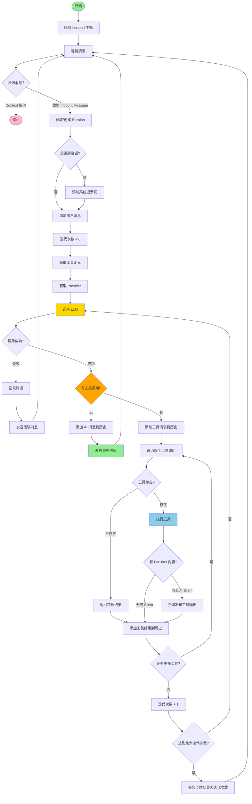

# 02 - Agent ReAct 循环

本文档深入讲解 unlimitedClaw 的核心——Agent 的 ReAct 循环。理解这个循环是掌握整个系统的关键。

## 目录

- [什么是 ReAct 模式](#什么是-react-模式)
- [ReAct 循环工作流程](#react-循环工作流程)
- [核心代码解析](#核心代码解析)
- [关键设计决策](#关键设计决策)
- [错误处理和安全机制](#错误处理和安全机制)
- [ReAct 循环流程图](#react-循环流程图)

## 什么是 ReAct 模式

**ReAct** = **Rea**son（推理）+ A**ct**（行动）

ReAct 是一种让大语言模型（LLM）能够交替进行推理和行动的模式。与传统的一次性生成答案不同，ReAct 允许 AI：

1. **分析问题**（Reason）：理解用户需求，决定下一步行动
2. **执行工具**（Act）：调用外部工具获取信息或执行操作
3. **观察结果**（Observe）：接收工具返回的结果
4. **继续推理**：基于结果继续思考，决定是否需要更多工具
5. **给出答案**：最终综合所有信息给出回答

### 示例对话流程

```
用户：北京今天天气如何？

[第 1 轮]
Agent 推理：我需要获取北京的天气信息
Agent 行动：调用 get_weather(city="北京")
工具结果：晴天，温度 15°C，湿度 40%

[第 2 轮]
Agent 推理：我已经有了天气信息，可以回答用户
Agent 回答：北京今天天气晴朗，温度 15°C，湿度 40%，适合外出活动。
```

### ReAct vs 传统 Chain-of-Thought

| 特性 | Chain-of-Thought | ReAct |
|------|------------------|-------|
| **推理方式** | 纯文本推理 | 推理 + 工具调用 |
| **信息来源** | 仅模型知识 | 模型知识 + 外部工具 |
| **实时性** | 依赖训练数据 | 可获取实时信息 |
| **可靠性** | 可能产生幻觉 | 工具结果更可靠 |
| **复杂任务** | 难以完成需要外部信息的任务 | 可完成复杂的多步骤任务 |

## ReAct 循环工作流程

unlimitedClaw 的 Agent 实现了完整的 ReAct 循环，以下是详细的步骤：

### 步骤 1：接收入站消息

Agent 监听消息总线的 `inbound` 主题，接收用户输入。

```go
// core/agent/agent.go 第 81-103 行
func (a *Agent) Start(ctx context.Context) {
    // 订阅 inbound 主题
    ch := a.bus.Subscribe(TopicInbound)
    defer a.bus.Unsubscribe(TopicInbound, ch)
    
    for {
        select {
        case <-ctx.Done():
            return
        case raw := <-ch:
            msg, ok := raw.(bus.InboundMessage)
            if !ok {
                a.logger.Error("invalid inbound message type", nil)
                continue
            }
            a.handleMessage(ctx, msg)
        }
    }
}
```

**InboundMessage 结构**（参见 `core/bus/message.go` 第 14-18 行）：
```go
type InboundMessage struct {
    SessionID string  // 会话 ID
    Content   string  // 用户消息内容
    Role      Role    // 消息角色（通常是 "user"）
}
```

### 步骤 2：获取或创建会话

每个对话都有一个独立的会话（Session），存储消息历史。

```go
func (a *Agent) handleMessage(ctx context.Context, msg bus.InboundMessage) {
    // 从 SessionStore 获取或创建会话
    sess := a.sessionStore.Get(msg.SessionID)
    if sess == nil {
        sess = session.NewSession(msg.SessionID)
        a.sessionStore.Set(sess)
    }
    
    // 添加系统提示词（如果是新会话）
    if sess.MessageCount() == 0 {
        sess.AddMessage(providers.Message{
            Role:    providers.RoleSystem,
            Content: a.systemPrompt,
        })
    }
    
    // 添加用户消息到历史
    sess.AddMessage(providers.Message{
        Role:    providers.RoleUser,
        Content: msg.Content,
    })
}
```

### 步骤 3：准备工具定义

获取所有注册的工具，转换为 LLM 能理解的格式。

```go
// 获取所有工具定义（按字母顺序）
toolDefs := a.toolRegistry.ListDefinitions()
```

工具定义示例：
```json
{
  "name": "get_weather",
  "description": "获取指定城市的天气信息",
  "parameters": [
    {
      "name": "city",
      "type": "string",
      "description": "城市名称",
      "required": true
    }
  ]
}
```

### 步骤 4：调用 LLM

将会话历史和工具定义发送给 LLM。

```go
// 获取 Provider
provider, modelName, err := a.providerFactory.GetProviderForModel(a.config.Model)
if err != nil {
    a.logger.Error("failed to get provider", err)
    return
}

// 调用 LLM
response, err := provider.Chat(
    ctx,
    sess.GetMessages(),  // 会话历史
    toolDefs,            // 可用工具
    modelName,           // 模型名称
    nil,                 // 选项（temperature 等）
)
```

### 步骤 5：处理 LLM 响应

LLM 可能返回两种结果：

#### 情况 A：文本响应（无工具调用）

```go
if len(response.ToolCalls) == 0 {
    // 将 AI 回答添加到会话
    sess.AddMessage(providers.Message{
        Role:    providers.RoleAssistant,
        Content: response.Content,
    })
    
    // 发布出站消息
    a.bus.Publish(TopicOutbound, bus.OutboundMessage{
        SessionID: msg.SessionID,
        Content:   response.Content,
        Role:      bus.RoleAssistant,
        Done:      true,
    })
    
    return // 结束循环
}
```

#### 情况 B：工具调用

```go
if len(response.ToolCalls) > 0 {
    // 将 AI 的工具调用请求添加到会话
    sess.AddMessage(providers.Message{
        Role:      providers.RoleAssistant,
        Content:   response.Content,
        ToolCalls: response.ToolCalls,
    })
    
    // 执行每个工具调用
    for _, toolCall := range response.ToolCalls {
        result := a.executeTool(ctx, toolCall)
        
        // 如果有 ForUser 内容，立即发送给用户
        if result.ForUser != "" && !result.Silent {
            a.bus.Publish(TopicOutbound, bus.OutboundMessage{
                SessionID: msg.SessionID,
                Content:   result.ForUser,
                Role:      bus.RoleTool,
                Done:      false,
            })
        }
        
        // 将工具结果添加到会话（ForLLM 内容）
        sess.AddMessage(providers.Message{
            Role:       providers.RoleTool,
            Content:    result.ForLLM,
            ToolCallID: toolCall.ID,
        })
    }
    
    // 回到步骤 4，再次调用 LLM
}
```

### 步骤 6：循环迭代

重复步骤 4-5，直到：
- LLM 返回文本响应（无工具调用）
- 达到最大迭代次数（默认 25 次）

```go
const MaxToolIterations = 25

for iteration := 0; iteration < MaxToolIterations; iteration++ {
    response, err := provider.Chat(...)
    
    if len(response.ToolCalls) == 0 {
        // 返回最终答案
        break
    }
    
    // 执行工具，继续循环
}

if iteration >= MaxToolIterations {
    a.logger.Warn("reached max tool iterations")
}
```

## 核心代码解析

### Agent 结构体

参见 `core/agent/agent.go` 第 20-31 行：

```go
type Agent struct {
    bus               bus.Bus                    // 消息总线
    toolRegistry      *tools.Registry            // 工具注册表
    providerFactory   *providers.Factory         // Provider 工厂
    sessionStore      session.SessionStore       // 会话存储
    historyManager    *session.HistoryManager    // 历史管理
    logger            logger.Logger              // 日志记录器
    config            *config.Config             // 配置
    systemPrompt      string                     // 系统提示词
    maxToolIterations int                        // 最大工具迭代次数
}
```

**所有依赖都通过构造函数注入**，Agent 不创建任何依赖。

### 工具执行逻辑

```go
func (a *Agent) executeTool(ctx context.Context, toolCall providers.ToolCall) *tools.ToolResult {
    // 从注册表获取工具
    tool, ok := a.toolRegistry.Get(toolCall.Name)
    if !ok {
        return &tools.ToolResult{
            ForLLM:  fmt.Sprintf("Error: tool %q not found", toolCall.Name),
            ForUser: "",
            IsError: true,
        }
    }
    
    // 执行工具
    result, err := tool.Execute(ctx, toolCall.Arguments)
    if err != nil {
        return &tools.ToolResult{
            ForLLM:  fmt.Sprintf("Error executing tool: %v", err),
            ForUser: "",
            IsError: true,
        }
    }
    
    return result
}
```

**关键设计**：工具返回 `ToolResult`，包含两个通道：
- `ForLLM`：总是发送给 LLM 作为上下文
- `ForUser`：可选，立即显示给用户

### 消息历史管理

会话（Session）维护完整的消息历史：

```
[系统提示词]
User: 北京天气如何？
Assistant: [ToolCalls: get_weather(city="北京")]
Tool: 晴天，15°C
Assistant: 北京今天天气晴朗，温度 15°C...
```

这个历史在每次调用 LLM 时都会发送，让 LLM 能够：
- 理解对话上下文
- 知道之前调用了哪些工具
- 基于工具结果进行推理

## 关键设计决策

### 决策 1：为什么使用消息总线？

**问题**：CLI 如何与 Agent 通信？

**方案 A**：直接调用
```go
cli.OnUserInput(func(input string) {
    response := agent.Process(input)
    cli.Print(response)
})
```

**方案 B**：消息总线（实际采用）
```go
// CLI
cli.OnUserInput(func(input string) {
    bus.Publish("inbound", InboundMessage{Content: input})
})
bus.Subscribe("outbound").OnMessage(func(msg OutboundMessage) {
    cli.Print(msg.Content)
})

// Agent
bus.Subscribe("inbound").OnMessage(func(msg InboundMessage) {
    response := agent.Process(msg)
    bus.Publish("outbound", response)
})
```

**为什么选择方案 B？**
1. **解耦**：CLI 和 Agent 互不依赖，可以独立测试
2. **可扩展**：可以轻松添加 HTTP、WebSocket 等其他通道
3. **异步**：Agent 可以异步处理消息，不阻塞 CLI
4. **多订阅者**：多个组件可以监听同一主题（如日志记录、监控）

### 决策 2：为什么会话与 Agent 分离？

**Session** 是独立的包（`core/session/`），不是 Agent 的内部状态。

**优势**：
1. **单一职责**：Agent 负责循环逻辑，Session 负责状态管理
2. **可测试性**：可以独立测试 Session 的线程安全性
3. **可替换性**：可以替换 SessionStore（内存 → Redis → 数据库）
4. **可复用性**：其他组件也可以使用 Session（如历史查询、分析）

### 决策 3：工具定义为什么按字母顺序？

参见 `core/tools/registry.go` 第 47-50 行注释：

```go
// CRITICAL: Alphabetical ordering is required for LLM KV cache optimization.
// When tools are always presented in the same order, the LLM can reuse its KV cache.
```

**原理**：
- LLM 使用 KV 缓存来加速推理
- 如果工具列表顺序改变，KV 缓存失效
- 按字母顺序排序，保证每次顺序一致
- LLM 可以重用缓存，显著提升性能

### 决策 4：为什么有最大迭代次数限制？

```go
const DefaultMaxToolIterations = 25
```

**原因**：
1. **防止无限循环**：AI 可能陷入工具调用死循环
2. **成本控制**：每次 LLM 调用都有成本（API 费用）
3. **用户体验**：避免用户长时间等待

**实际案例**：
- 正常对话：1-3 次迭代
- 复杂任务：5-10 次迭代
- 异常情况：如果达到 25 次，说明出现了问题

## 错误处理和安全机制

### 1. 工具执行错误

```go
result, err := tool.Execute(ctx, args)
if err != nil {
    // 将错误信息返回给 LLM
    return &tools.ToolResult{
        ForLLM:  fmt.Sprintf("Error: %v", err),
        IsError: true,
    }
}
```

**设计**：不中断循环，将错误返回给 LLM，让 LLM 决定如何处理。

### 2. Provider 错误

```go
response, err := provider.Chat(ctx, ...)
if err != nil {
    a.logger.Error("LLM call failed", err)
    a.bus.Publish(TopicOutbound, bus.OutboundMessage{
        Content: "抱歉，AI 服务暂时不可用，请稍后重试。",
        Done:    true,
    })
    return
}
```

**设计**：记录日志，向用户返回友好的错误消息。

### 3. Context 取消

```go
func (a *Agent) Start(ctx context.Context) {
    for {
        select {
        case <-ctx.Done():
            a.logger.Info("agent stopped by context")
            return
        case msg := <-ch:
            a.handleMessage(ctx, msg)
        }
    }
}
```

**设计**：支持优雅关闭，通过 `context.Context` 传递取消信号。

### 4. 线程安全

- **Session**：使用 `sync.RWMutex` 保护消息历史
- **ToolRegistry**：使用 `sync.RWMutex` 保护工具映射
- **Bus**：使用 `sync.RWMutex` 保护订阅者列表

## ReAct 循环流程图



### 流程图说明

- **绿色**：开始/结束/成功节点
- **黄色**：关键操作（调用 LLM）
- **蓝色**：工具执行
- **橙色**：重要决策点

### 典型执行路径

**简单问答**（无工具调用）：
```
Wait → Receive → GetSession → AddUser → CallLLM → PublishFinal → Wait
```

**工具调用**（1 次迭代）：
```
Wait → Receive → GetSession → AddUser → CallLLM 
→ ExecuteTool → AddToolResult → CallLLM → PublishFinal → Wait
```

**多轮工具调用**（2 次迭代）：
```
Wait → Receive → GetSession → AddUser → CallLLM
→ ExecuteTool → CallLLM
→ ExecuteTool → CallLLM → PublishFinal → Wait
```

## 实战示例

### 示例 1：获取天气信息

```
[用户输入]
User: 北京今天天气怎么样？

[第 1 轮 LLM 调用]
LLM 推理：用户想知道天气，我需要调用 get_weather 工具
LLM 响应：ToolCalls: [get_weather(city="北京")]

[工具执行]
执行 get_weather(city="北京")
工具返回：
  ForLLM: "北京：晴天，温度 15°C，湿度 40%，风力 2 级"
  ForUser: "🌤️ 正在查询北京天气..."

[第 2 轮 LLM 调用]
LLM 推理：我已经有了天气数据，可以给出友好的回答
LLM 响应：Content: "北京今天天气晴朗，温度 15°C，适合外出活动。"

[最终响应]
Assistant: 北京今天天气晴朗，温度 15°C，适合外出活动。
```

### 示例 2：多步骤任务

```
[用户输入]
User: 帮我查一下北京和上海今天哪个城市更适合户外活动

[第 1 轮 LLM 调用]
LLM 推理：需要获取两个城市的天气信息
LLM 响应：ToolCalls: [
  get_weather(city="北京"),
  get_weather(city="上海")
]

[工具执行]
工具 1 结果：北京：晴天，15°C
工具 2 结果：上海：小雨，18°C

[第 2 轮 LLM 调用]
LLM 推理：北京晴天，上海下雨，北京更适合户外活动
LLM 响应：Content: "北京今天天气晴朗，温度 15°C；上海有小雨，温度 18°C。
          北京更适合户外活动。"

[最终响应]
Assistant: 北京今天天气晴朗，温度 15°C；上海有小雨，温度 18°C。
          北京更适合户外活动。
```

## 小结

Agent 的 ReAct 循环是 unlimitedClaw 的核心，它实现了：

1. **智能推理**：LLM 能够理解复杂任务，分解为多个步骤
2. **工具调用**：通过工具获取实时信息或执行操作
3. **循环优化**：多轮迭代，逐步逼近最终答案
4. **安全机制**：最大迭代次数、错误处理、优雅关闭

**关键要点**：
- 消息总线解耦组件
- 会话管理分离关注点
- 工具顺序优化性能
- 双通道结果（ForLLM + ForUser）

下一步，我们将深入学习**工具系统**，了解如何实现和注册自定义工具。

👉 [下一章：工具系统](./03-tool-system.md)
