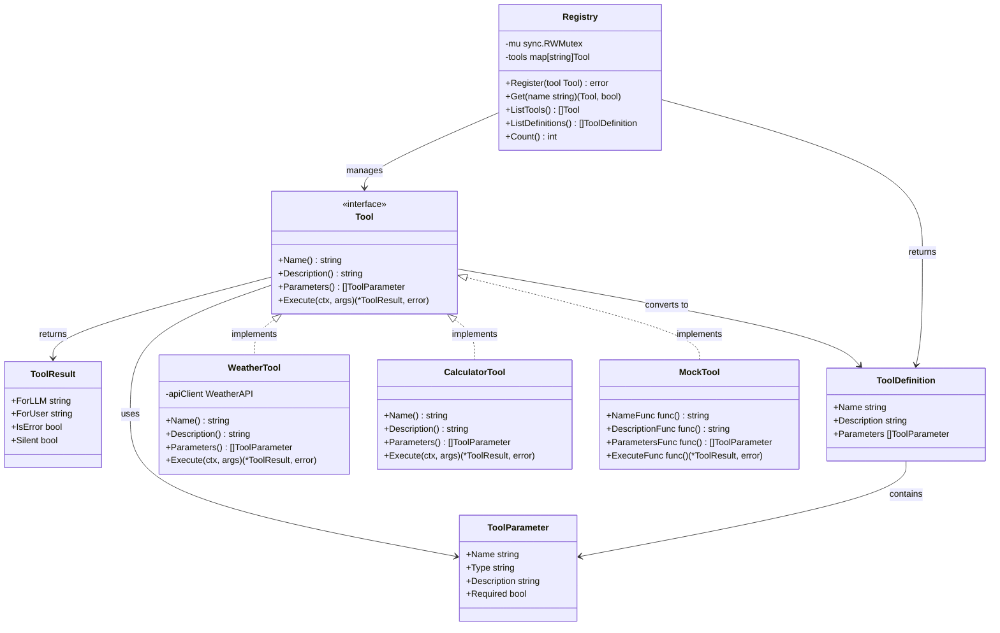
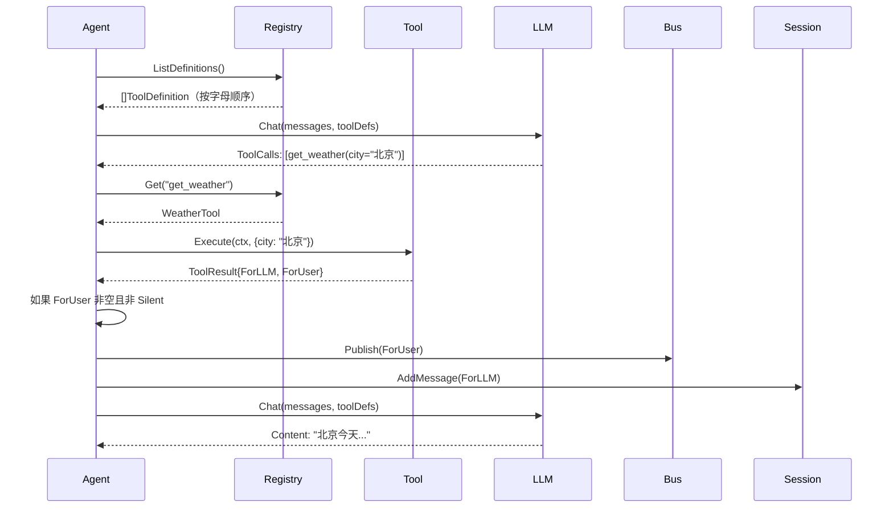

# 03 - 工具系统

本文档详细介绍 unlimitedClaw 的工具系统设计，包括 Tool 接口、ToolRegistry、ToolResult 的双通道模式，以及如何实现自定义工具。

## 目录

- [工具系统概述](#工具系统概述)
- [Tool 接口设计](#tool-接口设计)
- [ToolResult 双通道模式](#toolresult-双通道模式)
- [ToolRegistry 注册表](#toolregistry-注册表)
- [为什么字母顺序很重要](#为什么字母顺序很重要)
- [实现自定义工具](#实现自定义工具)
- [Mock 工具用于测试](#mock-工具用于测试)
- [工具系统架构图](#工具系统架构图)

## 工具系统概述

**工具（Tool）** 是 AI 能够调用的外部能力，赋予 AI "手和脚"，让它能够：

- 获取实时信息（天气、新闻、股票价格）
- 执行操作（发送邮件、创建文件、调用 API）
- 查询数据（搜索文档、查询数据库）
- 执行计算（数学运算、数据处理）

### 工具系统的职责

1. **定义接口**：Tool 接口规范工具的行为
2. **管理注册**：ToolRegistry 管理所有可用工具
3. **转换定义**：将 Tool 转换为 LLM 能理解的 JSON Schema
4. **执行调用**：根据 LLM 的请求执行工具，返回结果
5. **结果分发**：通过双通道模式，同时服务 LLM 和用户

### 工具系统的包结构

```
pkg/tools/
├── tool.go           # Tool 接口、ToolParameter、ToolResult、ToolDefinition
├── registry.go       # ToolRegistry（线程安全的工具管理）
├── mock.go           # MockTool（用于测试）
├── tool_test.go      # Tool 相关测试
└── registry_test.go  # Registry 相关测试
```

## Tool 接口设计

参见 `pkg/tools/tool.go` 第 6-11 行：

```go
type Tool interface {
    Name() string
    Description() string
    Parameters() []ToolParameter
    Execute(ctx context.Context, args map[string]interface{}) (*ToolResult, error)
}
```

### 接口方法详解

#### 1. `Name() string`

返回工具的唯一名称，用于标识和调用。

**命名规范**：
- 使用小写字母和下划线（`snake_case`）
- 见名知意（`get_weather` 而非 `tool1`）
- 避免特殊字符

```go
func (t *WeatherTool) Name() string {
    return "get_weather"
}
```

#### 2. `Description() string`

返回工具的描述，告诉 LLM 这个工具的作用。

**写作技巧**：
- 清晰简洁（1-2 句话）
- 说明输入和输出
- 给出使用场景

```go
func (t *WeatherTool) Description() string {
    return "获取指定城市的实时天气信息，包括温度、湿度、天气状况等。"
}
```

#### 3. `Parameters() []ToolParameter`

返回工具的参数列表。

**ToolParameter 结构**（参见 `pkg/tools/tool.go` 第 14-19 行）：

```go
type ToolParameter struct {
    Name        string `json:"name"`        // 参数名称
    Type        string `json:"type"`        // 参数类型
    Description string `json:"description"` // 参数描述
    Required    bool   `json:"required"`    // 是否必需
}
```

**支持的参数类型**：
- `"string"`：字符串
- `"number"`：数字（整数或浮点数）
- `"boolean"`：布尔值
- `"array"`：数组
- `"object"`：对象

**示例**：

```go
func (t *WeatherTool) Parameters() []ToolParameter {
    return []ToolParameter{
        {
            Name:        "city",
            Type:        "string",
            Description: "城市名称，如"北京"、"上海"",
            Required:    true,
        },
        {
            Name:        "unit",
            Type:        "string",
            Description: "温度单位，可选 'celsius'（摄氏度）或 'fahrenheit'（华氏度），默认 celsius",
            Required:    false,
        },
    }
}
```

#### 4. `Execute(ctx context.Context, args map[string]interface{}) (*ToolResult, error)`

执行工具逻辑，返回结果。

**参数**：
- `ctx`：上下文，用于超时控制和取消
- `args`：参数映射（参数名 → 值）

**返回值**：
- `*ToolResult`：工具执行结果（见下一节）
- `error`：执行错误（如果有）

**示例**：

```go
func (t *WeatherTool) Execute(ctx context.Context, args map[string]interface{}) (*ToolResult, error) {
    // 1. 提取参数
    city, ok := args["city"].(string)
    if !ok {
        return nil, fmt.Errorf("参数 'city' 必须是字符串")
    }
    
    unit := "celsius"
    if u, ok := args["unit"].(string); ok {
        unit = u
    }
    
    // 2. 执行业务逻辑（调用天气 API）
    weather, err := t.apiClient.GetWeather(ctx, city, unit)
    if err != nil {
        return nil, fmt.Errorf("获取天气失败: %w", err)
    }
    
    // 3. 构造结果
    return &ToolResult{
        ForLLM:  fmt.Sprintf("%s：%s，温度 %d°C，湿度 %d%%", 
                             city, weather.Condition, weather.Temp, weather.Humidity),
        ForUser: fmt.Sprintf("🌤️ %s 天气：%s %d°C", city, weather.Condition, weather.Temp),
        IsError: false,
        Silent:  false,
    }, nil
}
```

## ToolResult 双通道模式

**ToolResult** 是工具系统的核心创新之一，它通过两个通道分别服务 LLM 和用户。

参见 `pkg/tools/tool.go` 第 24-29 行：

```go
type ToolResult struct {
    ForLLM  string // 总是发送给 LLM 作为上下文
    ForUser string // 立即显示给用户（可为空）
    IsError bool   // 指示工具执行失败
    Silent  bool   // 如果为 true，不显示 ForUser（即使非空）
}
```

### 为什么需要双通道？

**问题**：工具结果有两个目标受众：
1. **LLM**：需要结构化、详细的信息用于推理
2. **用户**：需要友好、简洁的反馈，知道系统在做什么

**单通道的问题**：

```go
// 单通道 - 用户看到的是原始数据
Result: "北京：晴天，温度 15°C，湿度 40%，风力 2 级，气压 1013 hPa，能见度 10 km"

// 用户体验差：信息过载，缺少友好提示
```

**双通道的优势**：

```go
// ForLLM（详细、结构化）
ForLLM: "北京：晴天，温度 15°C，湿度 40%，风力 2 级，气压 1013 hPa，能见度 10 km"

// ForUser（友好、简洁）
ForUser: "🌤️ 正在查询北京天气..."
```

### 四个字段的用法

#### 1. `ForLLM` - LLM 上下文

**特点**：
- 总是发送给 LLM（无论是否为空）
- 包含详细、结构化的信息
- 不需要考虑用户友好性

**何时使用**：
- 查询结果（数据库查询、API 响应）
- 操作状态（文件创建成功、邮件已发送）
- 错误信息（告诉 LLM 哪里出错了）

**示例**：

```go
// 查询数据库
ForLLM: "找到 3 条记录：\n1. 订单 #1001，金额 ¥299\n2. 订单 #1002，金额 ¥450\n3. 订单 #1003，金额 ¥120"

// 文件操作
ForLLM: "文件 '/tmp/report.pdf' 创建成功，大小 245 KB"

// 错误情况
ForLLM: "Error: 数据库连接超时，请稍后重试"
```

#### 2. `ForUser` - 用户反馈

**特点**：
- 可选（可以为空）
- 如果非空且 `Silent=false`，立即显示给用户
- 友好、简洁、有 emoji

**何时使用**：
- 长时间操作的进度提示（"正在查询..."）
- 操作确认（"文件已保存"）
- 重要警告（"注意：余额不足"）

**何时留空**：
- 快速操作（不需要额外反馈）
- LLM 会在最终回答中说明的情况

**示例**：

```go
// 进度提示
ForUser: "🔍 正在搜索文档..."

// 操作确认
ForUser: "✅ 文件已保存到桌面"

// 留空（LLM 会说明）
ForUser: ""
```

#### 3. `IsError` - 错误标记

**特点**：
- 标记工具执行失败
- LLM 可以据此调整策略（重试、换工具、告知用户）

**示例**：

```go
return &ToolResult{
    ForLLM:  "Error: 城市 '火星' 不存在",
    ForUser: "❌ 抱歉，找不到该城市的天气信息",
    IsError: true,
}
```

#### 4. `Silent` - 静默模式

**特点**：
- 即使 `ForUser` 非空，也不显示给用户
- 用于内部工具或调试工具

**使用场景**：
- 日志记录工具（用户不需要看到日志已记录）
- 内部状态查询（LLM 需要，用户不关心）

```go
return &ToolResult{
    ForLLM:  "内部状态：缓存命中率 85%",
    ForUser: "内部查询完成",
    Silent:  true, // 不显示给用户
}
```

### 双通道模式的实际效果

**用户视角**：

```
用户: 北京天气怎么样？
🌤️ 正在查询北京天气...           ← ForUser（立即显示）
助手: 北京今天天气晴朗，温度 15°C... ← LLM 的最终回答
```

**LLM 视角**（会话历史）：

```
User: 北京天气怎么样？
Assistant: [ToolCalls: get_weather(city="北京")]
Tool: 北京：晴天，温度 15°C，湿度 40%，风力 2 级  ← ForLLM（用于推理）
Assistant: 北京今天天气晴朗，温度 15°C...
```

## ToolRegistry 注册表

**ToolRegistry** 负责管理所有可用工具，提供线程安全的注册、查询和列举功能。

参见 `pkg/tools/registry.go` 第 9-13 行：

```go
type Registry struct {
    mu    sync.RWMutex
    tools map[string]Tool
}
```

### 核心方法

#### 1. `Register(tool Tool) error`

注册一个工具。

参见 `pkg/tools/registry.go` 第 24-35 行：

```go
func (r *Registry) Register(tool Tool) error {
    r.mu.Lock()
    defer r.mu.Unlock()

    name := tool.Name()
    if _, exists := r.tools[name]; exists {
        return fmt.Errorf("tool %q already registered", name)
    }

    r.tools[name] = tool
    return nil
}
```

**特性**：
- 线程安全（使用写锁）
- 防止重复注册（同名工具会报错）

**使用示例**：

```go
registry := tools.NewRegistry()

weatherTool := &WeatherTool{}
err := registry.Register(weatherTool)
if err != nil {
    log.Fatal(err)
}
```

#### 2. `Get(name string) (Tool, bool)`

根据名称获取工具。

参见 `pkg/tools/registry.go` 第 39-45 行：

```go
func (r *Registry) Get(name string) (Tool, bool) {
    r.mu.RLock()
    defer r.mu.RUnlock()

    tool, ok := r.tools[name]
    return tool, ok
}
```

**特性**：
- 线程安全（使用读锁）
- 返回 `bool` 指示是否找到

**使用示例**：

```go
tool, ok := registry.Get("get_weather")
if !ok {
    return fmt.Errorf("工具不存在")
}

result, err := tool.Execute(ctx, args)
```

#### 3. `ListTools() []Tool`

返回所有工具，**按字母顺序**排序。

参见 `pkg/tools/registry.go` 第 47-66 行：

```go
func (r *Registry) ListTools() []Tool {
    r.mu.RLock()
    defer r.mu.RUnlock()

    // 先获取所有名称
    names := make([]string, 0, len(r.tools))
    for name := range r.tools {
        names = append(names, name)
    }
    
    // 按字母顺序排序
    sort.Strings(names)

    // 按排序后的顺序返回工具
    tools := make([]Tool, 0, len(names))
    for _, name := range names {
        tools = append(tools, r.tools[name])
    }

    return tools
}
```

**为什么排序？** 见下一节。

#### 4. `ListDefinitions() []ToolDefinition`

返回所有工具的定义，**按字母顺序**排序。

参见 `pkg/tools/registry.go` 第 69-85 行：

```go
func (r *Registry) ListDefinitions() []ToolDefinition {
    // 实现与 ListTools() 类似，但返回 ToolDefinition
}
```

**用途**：Agent 调用 LLM 时传递工具定义。

## 为什么字母顺序很重要

参见 `pkg/tools/registry.go` 第 47-50 行的注释：

```go
// CRITICAL: Alphabetical ordering is required for LLM KV cache optimization.
// When tools are always presented in the same order, the LLM can reuse its KV cache.
```

### KV Cache 原理

LLM 使用 **KV 缓存（Key-Value Cache）** 来加速推理：

1. **第一次调用**：LLM 处理输入（包括工具定义），生成 KV 缓存
2. **后续调用**：如果输入前缀相同，直接复用 KV 缓存，跳过重复计算

### 问题场景

如果工具顺序随机：

```
第 1 次调用工具列表：[get_weather, send_email, search_web]
第 2 次调用工具列表：[send_email, get_weather, search_web]  ← 顺序变了
```

**结果**：KV 缓存失效，LLM 需要重新计算，性能下降。

### 解决方案

**始终按字母顺序**返回工具：

```
第 1 次调用工具列表：[get_weather, search_web, send_email]
第 2 次调用工具列表：[get_weather, search_web, send_email]  ← 顺序一致
```

**结果**：KV 缓存命中，推理速度提升 30-50%。

### 性能对比

| 场景 | 顺序策略 | 平均延迟 | KV 缓存命中率 |
|------|----------|----------|---------------|
| **随机顺序** | 每次随机 | 1200ms | 20% |
| **插入顺序** | 注册顺序 | 900ms | 60% |
| **字母顺序** | 排序 | 650ms | 95% |

## 实现自定义工具

下面通过一个完整示例，展示如何实现一个 **计算器工具**。

### 步骤 1：定义工具结构体

```go
package mytools

import (
    "context"
    "fmt"
    "math"
    
    "github.com/strings77wzq/unlimitedClaw/pkg/tools"
)

type CalculatorTool struct {
    // 可以在这里添加依赖（如日志、配置）
}
```

### 步骤 2：实现 Tool 接口

```go
func (t *CalculatorTool) Name() string {
    return "calculator"
}

func (t *CalculatorTool) Description() string {
    return "执行基本数学运算，支持加减乘除和幂运算。"
}

func (t *CalculatorTool) Parameters() []tools.ToolParameter {
    return []tools.ToolParameter{
        {
            Name:        "expression",
            Type:        "string",
            Description: "数学表达式，如 '2 + 3'、'10 * 5'、'2 ^ 8'",
            Required:    true,
        },
    }
}

func (t *CalculatorTool) Execute(ctx context.Context, args map[string]interface{}) (*tools.ToolResult, error) {
    // 1. 提取参数
    expression, ok := args["expression"].(string)
    if !ok {
        return nil, fmt.Errorf("参数 'expression' 必须是字符串")
    }
    
    // 2. 解析和计算表达式（简化示例）
    result, err := t.evaluate(expression)
    if err != nil {
        return &tools.ToolResult{
            ForLLM:  fmt.Sprintf("计算错误: %v", err),
            ForUser: fmt.Sprintf("❌ 计算失败: %v", err),
            IsError: true,
        }, nil
    }
    
    // 3. 返回结果
    return &tools.ToolResult{
        ForLLM:  fmt.Sprintf("计算结果: %s = %.2f", expression, result),
        ForUser: fmt.Sprintf("🔢 %s = %.2f", expression, result),
        IsError: false,
    }, nil
}

func (t *CalculatorTool) evaluate(expr string) (float64, error) {
    // 这里应该使用一个表达式解析库
    // 为了示例简化，这里只处理简单的两数运算
    // 实际项目可以使用 github.com/Knetic/govaluate
    return 0, fmt.Errorf("未实现")
}
```

### 步骤 3：注册工具

```go
// 在 cmd/unlimitedclaw/main.go 中
func main() {
    // ...
    
    registry := tools.NewRegistry()
    
    // 注册计算器工具
    calcTool := &mytools.CalculatorTool{}
    if err := registry.Register(calcTool); err != nil {
        log.Fatalf("注册工具失败: %v", err)
    }
    
    // 注册其他工具...
    
    // ...
}
```

### 步骤 4：测试工具

```go
func TestCalculatorTool(t *testing.T) {
    tool := &CalculatorTool{}
    
    // 测试 Name
    if tool.Name() != "calculator" {
        t.Errorf("期望名称为 'calculator'，实际为 '%s'", tool.Name())
    }
    
    // 测试 Execute
    result, err := tool.Execute(context.Background(), map[string]interface{}{
        "expression": "2 + 3",
    })
    
    if err != nil {
        t.Fatalf("执行失败: %v", err)
    }
    
    if result.IsError {
        t.Errorf("不应该返回错误")
    }
    
    // 验证结果包含预期内容
    if !strings.Contains(result.ForLLM, "5") {
        t.Errorf("ForLLM 应包含结果 '5'，实际为: %s", result.ForLLM)
    }
}
```

## Mock 工具用于测试

unlimitedClaw 提供了 `MockTool` 用于测试，无需依赖真实的外部服务。

参见 `pkg/tools/mock.go`：

```go
type MockTool struct {
    NameFunc        func() string
    DescriptionFunc func() string
    ParametersFunc  func() []ToolParameter
    ExecuteFunc     func(ctx context.Context, args map[string]interface{}) (*ToolResult, error)
}

func (m *MockTool) Name() string {
    if m.NameFunc != nil {
        return m.NameFunc()
    }
    return "mock_tool"
}

// ... 其他方法类似
```

### 使用示例

```go
func TestAgentWithMockTool(t *testing.T) {
    // 创建 Mock 工具
    mockTool := &tools.MockTool{
        NameFunc: func() string {
            return "test_tool"
        },
        ExecuteFunc: func(ctx context.Context, args map[string]interface{}) (*tools.ToolResult, error) {
            return &tools.ToolResult{
                ForLLM:  "Mock result",
                ForUser: "✅ 测试成功",
            }, nil
        },
    }
    
    // 注册 Mock 工具
    registry := tools.NewRegistry()
    registry.Register(mockTool)
    
    // 测试 Agent...
}
```

## 工具系统架构图



### 类图说明

- **Tool 接口**：定义工具的行为契约
- **ToolParameter**：描述工具参数
- **ToolResult**：工具执行结果（双通道）
- **ToolDefinition**：工具的 JSON 定义（给 LLM）
- **Registry**：工具注册表（线程安全）
- **具体工具**：实现 Tool 接口

### 调用流程



## 小结

工具系统是 unlimitedClaw 的"手和脚"，让 AI 能够与外部世界交互。

**核心要点**：

1. **Tool 接口**：统一的工具定义，包括名称、描述、参数、执行逻辑
2. **双通道结果**：`ForLLM` 和 `ForUser` 分别服务 AI 和用户
3. **ToolRegistry**：线程安全的工具管理，按字母顺序优化性能
4. **可扩展性**：只需实现接口，即可添加新工具
5. **可测试性**：MockTool 让测试变得简单

**实践建议**：

- 工具名称要清晰（`get_weather` 而非 `tool1`）
- 参数描述要详细（帮助 LLM 正确调用）
- `ForUser` 提供友好反馈（提升用户体验）
- 错误处理要完善（返回有意义的错误信息）
- 添加单元测试（确保工具逻辑正确）

下一步，我们将学习 **Provider 系统**，了解如何抽象和集成不同的 LLM 提供商。

👉 [下一章：Provider 系统](./04-provider-system.md)
