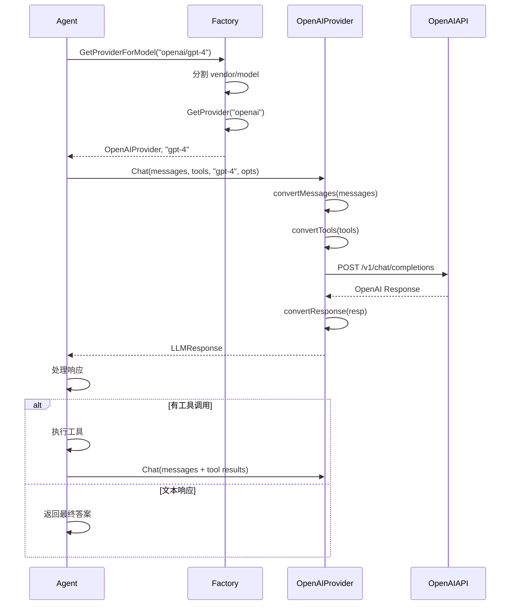

# 04 - Provider 系统

本文档详细介绍 unlimitedClaw 的 Provider 系统设计，包括 LLMProvider 接口、Message 和 ToolCall 类型、Factory 工厂模式，以及如何集成新的 LLM 提供商。

## 目录

- [Provider 系统概述](#provider-系统概述)
- [LLMProvider 接口设计](#llmprovider-接口设计)
- [核心数据类型](#核心数据类型)
- [Factory 工厂模式](#factory-工厂模式)
- [Vendor 路由机制](#vendor-路由机制)
- [Mock Provider 用于测试](#mock-provider-用于测试)
- [添加新 Provider 的步骤](#添加新-provider-的步骤)
- [Provider 系统架构图](#provider-系统架构图)

## Provider 系统概述

**Provider 系统** 是 unlimitedClaw 与 LLM 交互的抽象层，它隐藏了不同 LLM 服务商（OpenAI、Anthropic、Google 等）的 API 差异，提供统一的调用接口。

### 为什么需要 Provider 抽象？

**问题**：不同 LLM 提供商的 API 各不相同：

- **OpenAI**：使用 `messages` 数组，工具调用称为 `function_calling`
- **Anthropic (Claude)**：使用 `messages` 数组，工具调用称为 `tool_use`
- **Google (Gemini)**：使用 `contents` 数组，工具调用称为 `function_call`

**解决方案**：定义统一的 `LLMProvider` 接口，每个提供商实现自己的适配器。

```
Agent → LLMProvider 接口 → OpenAI Adapter → OpenAI API
                         → Anthropic Adapter → Claude API
                         → Google Adapter → Gemini API
```

### Provider 系统的职责

1. **定义接口**：LLMProvider 定义与 LLM 交互的契约
2. **统一数据类型**：Message、ToolCall、LLMResponse 等
3. **工厂路由**：根据模型名称自动选择 Provider
4. **错误处理**：统一的错误处理和重试机制
5. **测试支持**：MockProvider 用于单元测试

### Provider 系统的包结构

```
pkg/providers/
├── types.go           # LLMProvider 接口、Message、ToolCall、LLMResponse
├── factory.go         # Provider 工厂（路由）
├── mock.go            # MockProvider（用于测试）
├── types_test.go      # 类型测试
├── factory_test.go    # 工厂测试
└── mock_test.go       # Mock 测试
```

## LLMProvider 接口设计

参见 `pkg/providers/types.go` 第 58-67 行：

```go
type LLMProvider interface {
    // Chat 发送消息到 LLM 并返回响应
    // tools 参数包含可用工具的定义
    // model 是模型标识符（不含 vendor 前缀）
    Chat(ctx context.Context, messages []Message, toolDefs []tools.ToolDefinition, 
         model string, opts *ChatOptions) (*LLMResponse, error)

    // Name 返回 Provider 名称（如 "openai"、"anthropic"）
    Name() string
}
```

### 接口方法详解

#### 1. `Chat()` - 核心方法

向 LLM 发送消息并获取响应。

**参数**：

- `ctx context.Context`：上下文，用于超时控制和取消
- `messages []Message`：会话历史（包括用户消息、AI 回复、工具结果）
- `toolDefs []tools.ToolDefinition`：可用工具的定义列表
- `model string`：模型名称（**不含 vendor 前缀**，如 `"gpt-4"` 而非 `"openai/gpt-4"`）
- `opts *ChatOptions`：可选参数（temperature、max_tokens 等）

**返回值**：

- `*LLMResponse`：LLM 的响应（文本或工具调用）
- `error`：错误（如网络错误、API 错误）

**实现示例**（OpenAI）：

```go
func (p *OpenAIProvider) Chat(
    ctx context.Context,
    messages []Message,
    toolDefs []tools.ToolDefinition,
    model string,
    opts *ChatOptions,
) (*LLMResponse, error) {
    // 1. 转换为 OpenAI API 格式
    apiMessages := p.convertMessages(messages)
    apiTools := p.convertTools(toolDefs)
    
    // 2. 构造请求
    req := openai.ChatCompletionRequest{
        Model:    model,
        Messages: apiMessages,
        Tools:    apiTools,
    }
    
    if opts != nil {
        if opts.Temperature != nil {
            req.Temperature = *opts.Temperature
        }
        if opts.MaxTokens != nil {
            req.MaxTokens = *opts.MaxTokens
        }
    }
    
    // 3. 调用 OpenAI API
    resp, err := p.client.CreateChatCompletion(ctx, req)
    if err != nil {
        return nil, fmt.Errorf("OpenAI API 调用失败: %w", err)
    }
    
    // 4. 转换响应为统一格式
    return p.convertResponse(resp), nil
}
```

#### 2. `Name()` - 标识方法

返回 Provider 的名称，用于日志和调试。

```go
func (p *OpenAIProvider) Name() string {
    return "openai"
}

func (p *AnthropicProvider) Name() string {
    return "anthropic"
}
```

## 核心数据类型

### 1. Message - 消息

参见 `pkg/providers/types.go` 第 19-25 行：

```go
type Message struct {
    Role       Role       `json:"role"`                    // 角色
    Content    string     `json:"content"`                 // 内容
    ToolCalls  []ToolCall `json:"tool_calls,omitempty"`    // 工具调用（仅 Assistant）
    ToolCallID string     `json:"tool_call_id,omitempty"`  // 工具调用 ID（仅 Tool）
}
```

**Role 枚举**（参见 `pkg/providers/types.go` 第 9-17 行）：

```go
type Role string

const (
    RoleUser      Role = "user"      // 用户消息
    RoleAssistant Role = "assistant" // AI 助手消息
    RoleSystem    Role = "system"    // 系统提示词
    RoleTool      Role = "tool"      // 工具执行结果
)
```

**Message 的不同用法**：

#### 用户消息

```go
Message{
    Role:    RoleUser,
    Content: "北京天气怎么样？",
}
```

#### 系统提示词

```go
Message{
    Role:    RoleSystem,
    Content: "你是一个有帮助的 AI 助手，可以调用工具获取信息。",
}
```

#### AI 助手文本响应

```go
Message{
    Role:    RoleAssistant,
    Content: "北京今天天气晴朗，温度 15°C。",
}
```

#### AI 助手工具调用

```go
Message{
    Role:    RoleAssistant,
    Content: "",  // 可能为空
    ToolCalls: []ToolCall{
        {
            ID:   "call_abc123",
            Name: "get_weather",
            Arguments: map[string]interface{}{
                "city": "北京",
            },
        },
    },
}
```

#### 工具执行结果

```go
Message{
    Role:       RoleTool,
    Content:    "北京：晴天，温度 15°C，湿度 40%",
    ToolCallID: "call_abc123",  // 关联到 AI 的工具调用
}
```

### 2. ToolCall - 工具调用

参见 `pkg/providers/types.go` 第 28-32 行：

```go
type ToolCall struct {
    ID        string                 `json:"id"`         // 唯一标识符
    Name      string                 `json:"name"`       // 工具名称
    Arguments map[string]interface{} `json:"arguments"`  // 参数
}
```

**示例**：

```go
ToolCall{
    ID:   "call_xyz789",
    Name: "send_email",
    Arguments: map[string]interface{}{
        "to":      "user@example.com",
        "subject": "会议提醒",
        "body":    "明天上午 10 点开会",
    },
}
```

### 3. LLMResponse - LLM 响应

参见 `pkg/providers/types.go` 第 42-48 行：

```go
type LLMResponse struct {
    Content    string     `json:"content"`                // 文本内容
    ToolCalls  []ToolCall `json:"tool_calls,omitempty"`   // 工具调用（如果有）
    Usage      TokenUsage `json:"usage"`                  // Token 使用情况
    Model      string     `json:"model"`                  // 实际使用的模型
    StopReason string     `json:"stop_reason"`            // 停止原因
}
```

**TokenUsage**（参见 `pkg/providers/types.go` 第 34-39 行）：

```go
type TokenUsage struct {
    PromptTokens     int `json:"prompt_tokens"`      // 输入 Token 数
    CompletionTokens int `json:"completion_tokens"`  // 输出 Token 数
    TotalTokens      int `json:"total_tokens"`       // 总 Token 数
}
```

**响应类型**：

#### 文本响应

```go
LLMResponse{
    Content:   "北京今天天气晴朗，温度 15°C。",
    ToolCalls: nil,
    Usage: TokenUsage{
        PromptTokens:     150,
        CompletionTokens: 30,
        TotalTokens:      180,
    },
    Model:      "gpt-4",
    StopReason: "stop",
}
```

#### 工具调用响应

```go
LLMResponse{
    Content: "",  // 可能为空
    ToolCalls: []ToolCall{
        {
            ID:   "call_abc",
            Name: "get_weather",
            Arguments: map[string]interface{}{"city": "北京"},
        },
    },
    Usage: TokenUsage{...},
    Model: "gpt-4",
    StopReason: "tool_calls",
}
```

### 4. ChatOptions - 调用选项

参见 `pkg/providers/types.go` 第 50-56 行：

```go
type ChatOptions struct {
    Temperature *float64 `json:"temperature,omitempty"` // 温度（0-2）
    MaxTokens   *int     `json:"max_tokens,omitempty"`  // 最大 Token 数
    TopP        *float64 `json:"top_p,omitempty"`       // Top-P 采样
    Stop        []string `json:"stop,omitempty"`        // 停止序列
}
```

**使用示例**：

```go
temp := 0.7
maxTokens := 1000

opts := &ChatOptions{
    Temperature: &temp,
    MaxTokens:   &maxTokens,
}

response, err := provider.Chat(ctx, messages, toolDefs, "gpt-4", opts)
```

## Factory 工厂模式

**Factory** 负责管理和路由 Provider，根据模型名称自动选择正确的 Provider。

参见 `pkg/providers/factory.go` 第 9-13 行：

```go
type Factory struct {
    mu        sync.RWMutex
    providers map[string]LLMProvider  // vendor 名称 → Provider
}
```

### 核心方法

#### 1. `Register(vendor string, provider LLMProvider)`

注册一个 Provider。

参见 `pkg/providers/factory.go` 第 22-27 行：

```go
func (f *Factory) Register(vendor string, provider LLMProvider) {
    f.mu.Lock()
    defer f.mu.Unlock()
    f.providers[vendor] = provider
}
```

**使用示例**：

```go
factory := providers.NewFactory()

// 注册 OpenAI Provider
openaiProvider := openai.NewProvider(apiKey)
factory.Register("openai", openaiProvider)

// 注册 Anthropic Provider
anthropicProvider := anthropic.NewProvider(apiKey)
factory.Register("anthropic", anthropicProvider)
```

#### 2. `GetProvider(vendor string) (LLMProvider, error)`

根据 vendor 名称获取 Provider。

参见 `pkg/providers/factory.go` 第 29-40 行：

```go
func (f *Factory) GetProvider(vendor string) (LLMProvider, error) {
    f.mu.RLock()
    defer f.mu.RUnlock()

    provider, ok := f.providers[vendor]
    if !ok {
        return nil, fmt.Errorf("no provider registered for vendor: %s", vendor)
    }
    return provider, nil
}
```

#### 3. `GetProviderForModel(model string) (LLMProvider, string, error)`

根据模型名称获取 Provider，自动提取 vendor 前缀。

参见 `pkg/providers/factory.go` 第 42-60 行：

```go
func (f *Factory) GetProviderForModel(model string) (LLMProvider, string, error) {
    // 分割模型名称（vendor/model）
    parts := strings.SplitN(model, "/", 2)
    if len(parts) < 2 {
        return nil, "", fmt.Errorf("model name must include vendor prefix (format: vendor/model): %s", model)
    }

    vendor := parts[0]
    modelName := parts[1]

    // 获取 Provider
    provider, err := f.GetProvider(vendor)
    if err != nil {
        return nil, "", err
    }

    return provider, modelName, nil
}
```

**返回值**：
- `LLMProvider`：对应的 Provider
- `string`：模型名称（不含 vendor 前缀）
- `error`：错误（如果有）

**使用示例**：

```go
// Agent 中的使用
provider, modelName, err := f.GetProviderForModel("openai/gpt-4")
if err != nil {
    return err
}

// provider 是 OpenAIProvider 实例
// modelName 是 "gpt-4"（不含 "openai/" 前缀）

response, err := provider.Chat(ctx, messages, toolDefs, modelName, opts)
```

## Vendor 路由机制

### 模型名称格式

unlimitedClaw 使用 `vendor/model` 格式：

```
openai/gpt-4
openai/gpt-3.5-turbo
anthropic/claude-3-opus
anthropic/claude-3-sonnet
google/gemini-pro
```

### 路由流程

```
输入: "openai/gpt-4"
  ↓
strings.SplitN("/", 2)
  ↓
vendor = "openai"
modelName = "gpt-4"
  ↓
factory.GetProvider("openai")
  ↓
返回: OpenAIProvider, "gpt-4"
```

### 优势

1. **显式声明**：配置文件中清楚地看到使用哪个 Provider
2. **易于切换**：修改配置即可切换 Provider（`openai/gpt-4` → `anthropic/claude-3-opus`）
3. **多 Provider**：可以同时使用多个 Provider（不同场景用不同模型）
4. **无歧义**：避免模型名称冲突（不同 Provider 可能有同名模型）

### 配置示例

```json
{
  "model": "openai/gpt-4",
  "fallback_model": "anthropic/claude-3-sonnet",
  "agents": {
    "coding": {
      "model": "openai/gpt-4"
    },
    "writing": {
      "model": "anthropic/claude-3-opus"
    }
  }
}
```

## Mock Provider 用于测试

unlimitedClaw 提供了 `MockProvider` 用于测试，无需调用真实的 LLM API。

参见 `pkg/providers/mock.go`：

```go
type MockProvider struct {
    ChatFunc func(ctx context.Context, messages []Message, 
                  toolDefs []tools.ToolDefinition, model string, 
                  opts *ChatOptions) (*LLMResponse, error)
    NameFunc func() string
}

func (m *MockProvider) Chat(...) (*LLMResponse, error) {
    if m.ChatFunc != nil {
        return m.ChatFunc(...)
    }
    // 默认返回空响应
    return &LLMResponse{Content: "mock response"}, nil
}

func (m *MockProvider) Name() string {
    if m.NameFunc != nil {
        return m.NameFunc()
    }
    return "mock"
}
```

### 使用示例

#### 测试文本响应

```go
func TestAgentTextResponse(t *testing.T) {
    mockProvider := &providers.MockProvider{
        ChatFunc: func(ctx context.Context, messages []providers.Message, 
                       toolDefs []tools.ToolDefinition, model string, 
                       opts *providers.ChatOptions) (*providers.LLMResponse, error) {
            return &providers.LLMResponse{
                Content:   "这是测试响应",
                ToolCalls: nil,
            }, nil
        },
    }
    
    factory := providers.NewFactory()
    factory.Register("mock", mockProvider)
    
    // 测试 Agent...
}
```

#### 测试工具调用

```go
func TestAgentToolCall(t *testing.T) {
    callCount := 0
    
    mockProvider := &providers.MockProvider{
        ChatFunc: func(...) (*providers.LLMResponse, error) {
            callCount++
            
            if callCount == 1 {
                // 第一次调用：返回工具调用
                return &providers.LLMResponse{
                    ToolCalls: []providers.ToolCall{
                        {
                            ID:   "call_1",
                            Name: "test_tool",
                            Arguments: map[string]interface{}{
                                "arg": "value",
                            },
                        },
                    },
                }, nil
            }
            
            // 第二次调用：返回最终答案
            return &providers.LLMResponse{
                Content: "基于工具结果的最终答案",
            }, nil
        },
    }
    
    // 测试 Agent 的 ReAct 循环...
}
```

## 添加新 Provider 的步骤

下面演示如何添加一个新的 Provider（以 Anthropic Claude 为例）。

### 步骤 1：创建 Provider 包

```
pkg/providers/anthropic/
├── provider.go       # Provider 实现
├── client.go         # API 客户端
├── converter.go      # 格式转换
└── provider_test.go  # 测试
```

### 步骤 2：实现 LLMProvider 接口

```go
package anthropic

import (
    "context"
    "fmt"
    
    "github.com/strings77wzq/unlimitedClaw/pkg/providers"
    "github.com/strings77wzq/unlimitedClaw/pkg/tools"
)

type Provider struct {
    client *Client
    apiKey string
}

func NewProvider(apiKey string) *Provider {
    return &Provider{
        client: NewClient(apiKey),
        apiKey: apiKey,
    }
}

func (p *Provider) Name() string {
    return "anthropic"
}

func (p *Provider) Chat(
    ctx context.Context,
    messages []providers.Message,
    toolDefs []tools.ToolDefinition,
    model string,
    opts *providers.ChatOptions,
) (*providers.LLMResponse, error) {
    // 1. 转换为 Anthropic API 格式
    apiMessages := p.convertMessages(messages)
    apiTools := p.convertTools(toolDefs)
    
    // 2. 构造请求
    req := AnthropicRequest{
        Model:      model,
        Messages:   apiMessages,
        Tools:      apiTools,
        MaxTokens:  4096,
    }
    
    if opts != nil && opts.Temperature != nil {
        req.Temperature = *opts.Temperature
    }
    
    // 3. 调用 Anthropic API
    resp, err := p.client.CreateMessage(ctx, req)
    if err != nil {
        return nil, fmt.Errorf("Anthropic API 调用失败: %w", err)
    }
    
    // 4. 转换响应
    return p.convertResponse(resp), nil
}
```

### 步骤 3：实现格式转换

```go
// converter.go

func (p *Provider) convertMessages(messages []providers.Message) []AnthropicMessage {
    result := make([]AnthropicMessage, 0, len(messages))
    
    for _, msg := range messages {
        apiMsg := AnthropicMessage{
            Role:    string(msg.Role),
            Content: msg.Content,
        }
        
        // Anthropic 的工具调用格式不同
        if len(msg.ToolCalls) > 0 {
            apiMsg.Content = p.formatToolCalls(msg.ToolCalls)
        }
        
        result = append(result, apiMsg)
    }
    
    return result
}

func (p *Provider) convertTools(toolDefs []tools.ToolDefinition) []AnthropicTool {
    // 转换工具定义为 Anthropic 格式
    // ...
}

func (p *Provider) convertResponse(resp *AnthropicResponse) *providers.LLMResponse {
    // 转换 Anthropic 响应为统一格式
    // ...
}
```

### 步骤 4：注册 Provider

```go
// cmd/unlimitedclaw/main.go

import (
    "github.com/strings77wzq/unlimitedClaw/pkg/providers"
    "github.com/strings77wzq/unlimitedClaw/pkg/providers/anthropic"
)

func main() {
    // ...
    
    factory := providers.NewFactory()
    
    // 注册 Anthropic Provider
    anthropicKey := os.Getenv("ANTHROPIC_API_KEY")
    anthropicProvider := anthropic.NewProvider(anthropicKey)
    factory.Register("anthropic", anthropicProvider)
    
    // ...
}
```

### 步骤 5：测试 Provider

```go
func TestAnthropicProvider(t *testing.T) {
    apiKey := os.Getenv("ANTHROPIC_API_KEY")
    if apiKey == "" {
        t.Skip("ANTHROPIC_API_KEY not set")
    }
    
    provider := NewProvider(apiKey)
    
    messages := []providers.Message{
        {Role: providers.RoleUser, Content: "你好"},
    }
    
    resp, err := provider.Chat(context.Background(), messages, nil, "claude-3-sonnet", nil)
    if err != nil {
        t.Fatalf("Chat 失败: %v", err)
    }
    
    if resp.Content == "" {
        t.Error("响应内容为空")
    }
}
```

### 步骤 6：更新配置

```json
{
  "model": "anthropic/claude-3-opus",
  "providers": {
    "anthropic": {
      "api_key_env": "ANTHROPIC_API_KEY"
    }
  }
}
```

## Provider 系统架构图

```mermaid
classDiagram
    class LLMProvider {
        <<interface>>
        +Chat(ctx, messages, tools, model, opts) (*LLMResponse, error)
        +Name() string
    }
    
    class Message {
        +Role Role
        +Content string
        +ToolCalls []ToolCall
        +ToolCallID string
    }
    
    class ToolCall {
        +ID string
        +Name string
        +Arguments map[string]interface{}
    }
    
    class LLMResponse {
        +Content string
        +ToolCalls []ToolCall
        +Usage TokenUsage
        +Model string
        +StopReason string
    }
    
    class TokenUsage {
        +PromptTokens int
        +CompletionTokens int
        +TotalTokens int
    }
    
    class ChatOptions {
        +Temperature *float64
        +MaxTokens *int
        +TopP *float64
        +Stop []string
    }
    
    class Factory {
        -mu sync.RWMutex
        -providers map[string]LLMProvider
        +Register(vendor, provider)
        +GetProvider(vendor) (LLMProvider, error)
        +GetProviderForModel(model) (LLMProvider, string, error)
    }
    
    class OpenAIProvider {
        -client *OpenAIClient
        -apiKey string
        +Chat(...) (*LLMResponse, error)
        +Name() string
    }
    
    class AnthropicProvider {
        -client *AnthropicClient
        -apiKey string
        +Chat(...) (*LLMResponse, error)
        +Name() string
    }
    
    class MockProvider {
        +ChatFunc func(...) (*LLMResponse, error)
        +NameFunc func() string
        +Chat(...) (*LLMResponse, error)
        +Name() string
    }
    
    LLMProvider <|.. OpenAIProvider : implements
    LLMProvider <|.. AnthropicProvider : implements
    LLMProvider <|.. MockProvider : implements
    
    LLMProvider --> Message : uses
    LLMProvider --> LLMResponse : returns
    LLMProvider --> ChatOptions : uses
    
    Message --> ToolCall : contains
    LLMResponse --> ToolCall : contains
    LLMResponse --> TokenUsage : contains
    
    Factory --> LLMProvider : manages
```

### 调用序列图



## 小结

Provider 系统是 unlimitedClaw 与 LLM 交互的抽象层，它隐藏了不同 LLM 服务商的 API 差异。

**核心要点**：

1. **LLMProvider 接口**：统一的 LLM 调用接口，隔离 API 差异
2. **统一数据类型**：Message、ToolCall、LLMResponse 等
3. **Factory 工厂**：根据模型名称（`vendor/model`）自动路由
4. **Vendor 前缀**：显式声明使用哪个 Provider
5. **可扩展性**：只需实现接口，即可添加新 Provider
6. **可测试性**：MockProvider 让测试变得简单

**实践建议**：

- 使用 `vendor/model` 格式配置模型
- Provider 实现应处理格式转换（API 格式 ↔ 统一格式）
- 错误处理要完善（网络错误、API 限流、超时）
- 添加重试机制（处理临时故障）
- 记录 Token 使用情况（成本分析）

下一步，我们将学习**消息总线**，了解组件间如何通过 Pub/Sub 模式通信。

👉 [下一章：消息总线](./05-message-bus.md)
