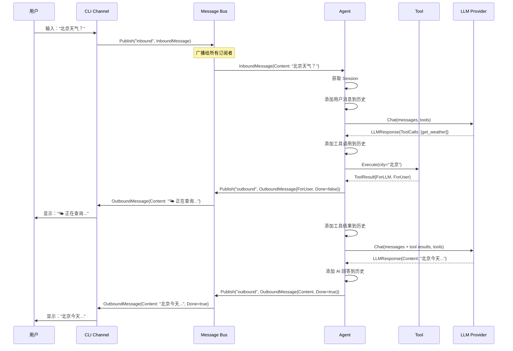
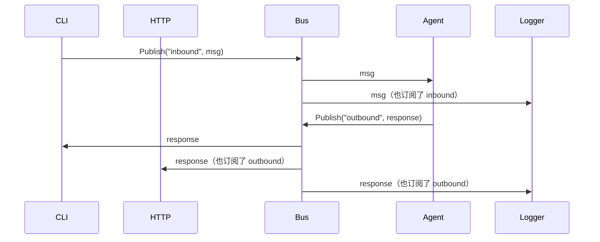

# 05 - 消息总线

本文档详细介绍 unlimitedClaw 的消息总线（Message Bus）设计，包括 Pub/Sub 模式、Bus 接口、线程安全设计、非阻塞发布机制，以及消息流转的完整过程。

## 目录

- [消息总线概述](#消息总线概述)
- [Pub/Sub 模式原理](#pubsub-模式原理)
- [Bus 接口设计](#bus-接口设计)
- [消息类型定义](#消息类型定义)
- [memBus 实现细节](#membus-实现细节)
- [非阻塞发布设计](#非阻塞发布设计)
- [线程安全保证](#线程安全保证)
- [消息总线如何解耦组件](#消息总线如何解耦组件)
- [消息流转序列图](#消息流转序列图)

## 消息总线概述

**消息总线（Message Bus）** 是 unlimitedClaw 的通信中枢，采用 **Pub/Sub（发布/订阅）** 模式，实现组件间的松耦合通信。

### 为什么需要消息总线？

**问题**：如果没有消息总线，组件间直接调用：

```go
// 紧耦合方式
cli.OnUserInput(func(input string) {
    response := agent.Process(input)  // CLI 直接依赖 Agent
    cli.Print(response)
})
```

**缺点**：
1. **强依赖**：CLI 必须知道 Agent 的存在和接口
2. **难以扩展**：添加新的输入通道（HTTP、WebSocket）需要修改 Agent
3. **难以测试**：无法独立测试 CLI 或 Agent
4. **无法广播**：一个消息只能发给一个接收者

**解决方案**：引入消息总线

```go
// 松耦合方式
// CLI
bus.Publish("inbound", InboundMessage{Content: input})

// Agent
bus.Subscribe("inbound").OnMessage(func(msg InboundMessage) {
    response := agent.Process(msg)
    bus.Publish("outbound", response)
})

// CLI
bus.Subscribe("outbound").OnMessage(func(msg OutboundMessage) {
    cli.Print(msg.Content)
})
```

**优势**：
1. **零依赖**：CLI 和 Agent 互不依赖
2. **易于扩展**：添加 HTTP 通道只需订阅相同主题
3. **易于测试**：可以用 Mock Bus 独立测试
4. **支持广播**：多个订阅者可以同时接收消息

### 消息总线的职责

1. **发布消息**：组件发布消息到指定主题
2. **订阅主题**：组件订阅感兴趣的主题
3. **消息分发**：将消息分发给所有订阅者
4. **生命周期管理**：取消订阅、关闭总线
5. **线程安全**：保证并发操作的安全性

### 消息总线的包结构

```
pkg/bus/
├── bus.go         # Bus 接口和 memBus 实现
├── message.go     # InboundMessage、OutboundMessage 定义
├── bus_test.go    # Bus 测试
└── message_test.go # Message 测试
```

## Pub/Sub 模式原理

**Pub/Sub（发布/订阅）** 是一种消息传递模式，解耦消息的发送者（Publisher）和接收者（Subscriber）。

### 核心概念

```
发布者 → [主题 Topic] → 订阅者 1
                      → 订阅者 2
                      → 订阅者 3
```

- **发布者（Publisher）**：发送消息到主题，不关心谁在监听
- **订阅者（Subscriber）**：订阅主题，接收相关消息
- **主题（Topic）**：消息的分类标签，如 `"inbound"`、`"outbound"`

### 与传统调用的对比

| 特性 | 直接调用 | Pub/Sub |
|------|----------|---------|
| **耦合度** | 高（调用者依赖被调用者） | 低（通过主题解耦） |
| **一对多** | 需要手动实现 | 天然支持 |
| **可测试性** | 难以 Mock | 易于 Mock |
| **扩展性** | 需要修改调用者 | 只需添加订阅者 |
| **灵活性** | 编译时确定 | 运行时动态 |

### unlimitedClaw 中的主题

| 主题 | 发布者 | 订阅者 | 用途 |
|------|--------|--------|------|
| `inbound` | CLI、HTTP 等 | Agent | 用户输入消息 |
| `outbound` | Agent | CLI、HTTP 等 | AI 响应消息 |

**未来可能的主题**：
- `log`：日志消息（所有组件 → 日志记录器）
- `metrics`：性能指标（所有组件 → 监控系统）
- `error`：错误事件（所有组件 → 错误追踪）

## Bus 接口设计

参见 `pkg/bus/bus.go` 第 6-11 行：

```go
type Bus interface {
    Publish(topic string, msg interface{})
    Subscribe(topic string) <-chan interface{}
    Unsubscribe(topic string, ch <-chan interface{})
    Close()
}
```

### 接口方法详解

#### 1. `Publish(topic string, msg interface{})`

发布消息到指定主题。

**参数**：
- `topic`：主题名称（如 `"inbound"`、`"outbound"`）
- `msg`：消息内容（任意类型，通常是 `InboundMessage` 或 `OutboundMessage`）

**特性**：
- **非阻塞**：发布者不会等待订阅者处理（见下文）
- **广播**：消息会发送给该主题的所有订阅者

**使用示例**：

```go
// CLI 发布用户输入
bus.Publish("inbound", bus.InboundMessage{
    SessionID: "session_1",
    Content:   "北京天气怎么样？",
    Role:      bus.RoleUser,
})

// Agent 发布 AI 响应
bus.Publish("outbound", bus.OutboundMessage{
    SessionID: "session_1",
    Content:   "北京今天天气晴朗...",
    Role:      bus.RoleAssistant,
    Done:      true,
})
```

#### 2. `Subscribe(topic string) <-chan interface{}`

订阅主题，返回接收消息的通道。

**参数**：
- `topic`：要订阅的主题名称

**返回值**：
- `<-chan interface{}`：只读通道，接收该主题的消息

**使用示例**：

```go
// Agent 订阅用户输入
inboundCh := bus.Subscribe("inbound")

for msg := range inboundCh {
    inboundMsg, ok := msg.(bus.InboundMessage)
    if !ok {
        log.Error("无效的消息类型")
        continue
    }
    
    // 处理消息
    agent.handleMessage(inboundMsg)
}
```

**配合 select 使用**：

```go
inboundCh := bus.Subscribe("inbound")

for {
    select {
    case <-ctx.Done():
        return
    case msg := <-inboundCh:
        // 处理消息
    }
}
```

#### 3. `Unsubscribe(topic string, ch <-chan interface{})`

取消订阅。

**参数**：
- `topic`：主题名称
- `ch`：之前订阅时返回的通道

**使用示例**：

```go
ch := bus.Subscribe("inbound")
defer bus.Unsubscribe("inbound", ch)

// 使用 ch 接收消息...
```

**为什么需要传递通道？**
- 一个主题可以有多个订阅者
- 通道是唯一标识符，用于定位要取消的订阅

#### 4. `Close()`

关闭总线，清理所有订阅。

**行为**：
- 关闭所有订阅者的通道
- 清空订阅者列表
- 标记总线为已关闭状态（后续 Publish 无效）

**使用示例**：

```go
bus := bus.New()
defer bus.Close()

// 使用 bus...
```

## 消息类型定义

参见 `pkg/bus/message.go`：

### 1. Role 枚举

```go
type Role string

const (
    RoleUser      Role = "user"
    RoleAssistant Role = "assistant"
    RoleSystem    Role = "system"
    RoleTool      Role = "tool"
)
```

**说明**：与 `providers.Role` 重复定义，保持 `bus` 包的独立性（不依赖 `providers`）。

### 2. InboundMessage - 入站消息

参见 `pkg/bus/message.go` 第 14-18 行：

```go
type InboundMessage struct {
    SessionID string  // 会话 ID
    Content   string  // 消息内容
    Role      Role    // 消息角色（通常是 "user"）
}
```

**用途**：从外部通道（CLI、HTTP）进入系统的消息。

**示例**：

```go
InboundMessage{
    SessionID: "user_12345",
    Content:   "帮我写一个 Go HTTP 服务器",
    Role:      RoleUser,
}
```

### 3. OutboundMessage - 出站消息

参见 `pkg/bus/message.go` 第 21-26 行：

```go
type OutboundMessage struct {
    SessionID string  // 会话 ID
    Content   string  // 消息内容
    Role      Role    // 消息角色（"assistant" 或 "tool"）
    Done      bool    // 是否是最终响应（用于流式传输）
}
```

**用途**：从系统发送到外部通道的消息。

**字段说明**：

- `SessionID`：关联到对应的会话
- `Content`：消息内容（AI 回答或工具输出）
- `Role`：
  - `RoleAssistant`：AI 的最终回答
  - `RoleTool`：工具的中间输出（如 "🌤️ 正在查询天气..."）
- `Done`：
  - `true`：最终响应，会话结束
  - `false`：中间消息，还有后续内容

**示例**：

```go
// 工具中间输出
OutboundMessage{
    SessionID: "user_12345",
    Content:   "🔍 正在搜索相关文档...",
    Role:      RoleTool,
    Done:      false,
}

// AI 最终响应
OutboundMessage{
    SessionID: "user_12345",
    Content:   "这是一个简单的 HTTP 服务器示例...",
    Role:      RoleAssistant,
    Done:      true,
}
```

## memBus 实现细节

**memBus** 是 Bus 接口的内存实现，适合单机部署。

参见 `pkg/bus/bus.go` 第 14-18 行：

```go
type memBus struct {
    mu          sync.RWMutex
    subscribers map[string][]chan interface{}
    closed      bool
}
```

### 数据结构

```
subscribers: map[string][]chan interface{}

{
    "inbound": [
        chan1,  // Agent 的订阅通道
        chan2,  // 日志记录器的订阅通道
    ],
    "outbound": [
        chan3,  // CLI 的订阅通道
        chan4,  // HTTP 服务器的订阅通道
    ]
}
```

### 创建总线

参见 `pkg/bus/bus.go` 第 20-25 行：

```go
func New() Bus {
    return &memBus{
        subscribers: make(map[string][]chan interface{}),
    }
}
```

### Publish 实现

参见 `pkg/bus/bus.go` 第 28-47 行：

```go
func (b *memBus) Publish(topic string, msg interface{}) {
    b.mu.RLock()
    defer b.mu.RUnlock()

    // 如果总线已关闭，直接返回
    if b.closed {
        return
    }

    // 获取该主题的订阅者列表
    subs, ok := b.subscribers[topic]
    if !ok {
        return
    }

    // 向每个订阅者发送消息（非阻塞）
    for _, ch := range subs {
        select {
        case ch <- msg:
        default:
        }
    }
}
```

**关键设计**：
1. **读锁**：允许多个 goroutine 同时发布
2. **非阻塞**：使用 `select` + `default`，避免阻塞发布者
3. **已关闭检查**：防止向已关闭的总线发布

### Subscribe 实现

参见 `pkg/bus/bus.go` 第 50-57 行：

```go
func (b *memBus) Subscribe(topic string) <-chan interface{} {
    b.mu.Lock()
    defer b.mu.Unlock()

    // 创建缓冲通道（容量 100）
    ch := make(chan interface{}, 100)
    
    // 添加到订阅者列表
    b.subscribers[topic] = append(b.subscribers[topic], ch)
    
    return ch
}
```

**关键设计**：
1. **写锁**：修改订阅者列表需要独占访问
2. **缓冲通道**：容量 100，减少阻塞概率
3. **返回只读通道**：防止订阅者关闭通道（由总线管理）

### Unsubscribe 实现

参见 `pkg/bus/bus.go` 第 60-76 行：

```go
func (b *memBus) Unsubscribe(topic string, ch <-chan interface{}) {
    b.mu.Lock()
    defer b.mu.Unlock()

    subs, ok := b.subscribers[topic]
    if !ok {
        return
    }

    // 查找并移除该通道
    for i, sub := range subs {
        if sub == ch {
            close(sub)
            b.subscribers[topic] = append(subs[:i], subs[i+1:]...)
            break
        }
    }
}
```

**关键设计**：
1. **写锁**：修改订阅者列表
2. **关闭通道**：通知订阅者停止接收
3. **切片移除**：从订阅者列表中删除该通道

### Close 实现

参见 `pkg/bus/bus.go` 第 79-96 行：

```go
func (b *memBus) Close() {
    b.mu.Lock()
    defer b.mu.Unlock()

    if b.closed {
        return
    }

    b.closed = true

    // 关闭所有订阅者的通道
    for _, subs := range b.subscribers {
        for _, ch := range subs {
            close(ch)
        }
    }

    // 清空订阅者列表
    b.subscribers = make(map[string][]chan interface{})
}
```

**关键设计**：
1. **写锁**：独占访问
2. **幂等性**：重复调用 `Close()` 不会出错
3. **关闭通道**：通知所有订阅者
4. **清空列表**：释放内存

## 非阻塞发布设计

### 为什么需要非阻塞？

**问题场景**：如果使用阻塞发布：

```go
// 阻塞版本
for _, ch := range subs {
    ch <- msg  // 如果 ch 满了，会阻塞
}
```

**后果**：
- 如果某个订阅者处理很慢，通道缓冲区满
- 发布者会阻塞，等待订阅者消费
- 整个系统被慢订阅者拖慢

### 解决方案：select + default

参见 `pkg/bus/bus.go` 第 42-45 行：

```go
for _, ch := range subs {
    select {
    case ch <- msg:
        // 成功发送
    default:
        // 通道满了，丢弃消息
    }
}
```

**工作原理**：
- 如果通道有空间，发送消息
- 如果通道满了，执行 `default` 分支，立即返回

### 权衡

| 方面 | 阻塞发布 | 非阻塞发布 |
|------|----------|-----------|
| **可靠性** | 消息不丢失 | 可能丢失消息 |
| **性能** | 受慢订阅者影响 | 不受慢订阅者影响 |
| **复杂性** | 简单 | 需要考虑丢消息场景 |

**unlimitedClaw 的选择**：非阻塞发布

**原因**：
1. **性能优先**：不能让慢订阅者影响整个系统
2. **缓冲足够**：通道容量 100，正常情况不会满
3. **可接受丢失**：丢失的通常是中间进度消息，不影响最终结果

### 如何避免丢消息？

1. **增大缓冲**：通道容量从 100 增加到更大
2. **快速处理**：订阅者及时消费消息
3. **监控告警**：记录丢失次数，超过阈值告警

```go
// 改进版：记录丢失
for _, ch := range subs {
    select {
    case ch <- msg:
    default:
        b.logger.Warn("消息丢失", "topic", topic)
        b.metrics.IncDropped(topic)
    }
}
```

## 线程安全保证

memBus 使用 `sync.RWMutex` 保证线程安全。

### 读写锁策略

```go
type memBus struct {
    mu          sync.RWMutex  // 读写锁
    subscribers map[string][]chan interface{}
    closed      bool
}
```

### 操作分类

| 操作 | 锁类型 | 原因 |
|------|--------|------|
| `Publish` | 读锁（RLock） | 只读订阅者列表，允许并发发布 |
| `Subscribe` | 写锁（Lock） | 修改订阅者列表，需要独占 |
| `Unsubscribe` | 写锁（Lock） | 修改订阅者列表，需要独占 |
| `Close` | 写锁（Lock） | 修改订阅者列表 + 修改 closed 标志 |

### 并发场景

**场景 1：多个 goroutine 同时发布**

```go
// goroutine 1
go bus.Publish("inbound", msg1)

// goroutine 2
go bus.Publish("inbound", msg2)

// goroutine 3
go bus.Publish("outbound", msg3)
```

**结果**：读锁允许并发，性能高。

**场景 2：发布时订阅**

```go
// goroutine 1 - 发布（持有读锁）
bus.Publish("inbound", msg)

// goroutine 2 - 订阅（需要写锁，等待）
ch := bus.Subscribe("inbound")
```

**结果**：订阅操作会等待发布完成。

**场景 3：关闭总线**

```go
// goroutine 1 - 发布
bus.Publish("inbound", msg)

// goroutine 2 - 关闭
bus.Close()
```

**结果**：
- `Close()` 获取写锁，等待所有 `Publish()` 完成
- 之后的 `Publish()` 检测到 `closed=true`，直接返回

## 消息总线如何解耦组件

### 解耦示例：CLI 与 Agent

**没有消息总线**（紧耦合）：

```go
package cli

import "github.com/strings77wzq/unlimitedClaw/pkg/agent"

type CLI struct {
    agent *agent.Agent  // 直接依赖 Agent
}

func (c *CLI) ReadInput() {
    input := c.scanner.Scan()
    response := c.agent.Process(input)  // 直接调用
    c.Print(response)
}
```

**问题**：
- CLI 包必须 import agent 包
- 无法替换 Agent 实现
- 测试时必须创建真实的 Agent

**有消息总线**（松耦合）：

```go
package cli

import "github.com/strings77wzq/unlimitedClaw/pkg/bus"

type CLI struct {
    bus bus.Bus  // 只依赖 Bus 接口
}

func (c *CLI) ReadInput() {
    input := c.scanner.Scan()
    
    // 发布消息，不关心谁处理
    c.bus.Publish("inbound", bus.InboundMessage{
        Content: input,
    })
}

func (c *CLI) Start() {
    // 订阅响应，不关心谁发送
    ch := c.bus.Subscribe("outbound")
    
    for msg := range ch {
        outMsg := msg.(bus.OutboundMessage)
        c.Print(outMsg.Content)
    }
}
```

**优势**：
- CLI 不知道 Agent 的存在
- 可以用 Mock Bus 测试 CLI
- 可以添加多个处理器（Agent、日志、监控）

### 解耦示例：添加 HTTP 通道

**不需要修改任何现有代码**：

```go
package http

import "github.com/strings77wzq/unlimitedClaw/pkg/bus"

type Server struct {
    bus bus.Bus
}

func (s *Server) HandleChat(w http.ResponseWriter, r *http.Request) {
    var req ChatRequest
    json.NewDecoder(r.Body).Decode(&req)
    
    // 发布到 inbound（与 CLI 相同）
    s.bus.Publish("inbound", bus.InboundMessage{
        SessionID: req.SessionID,
        Content:   req.Message,
    })
    
    // 订阅 outbound（与 CLI 相同）
    ch := s.bus.Subscribe("outbound")
    defer s.bus.Unsubscribe("outbound", ch)
    
    // 等待响应...
}
```

**结果**：
- Agent 不需要修改（它只关心 bus）
- CLI 继续工作（共享同一个 bus）
- 系统无缝扩展

## 消息流转序列图



### 流程说明

1. **用户输入** → CLI 接收
2. **CLI** → Bus：发布 `InboundMessage`
3. **Bus** → Agent：分发消息
4. **Agent** → Provider：调用 LLM
5. **Provider** → Agent：返回工具调用
6. **Agent** → Tool：执行工具
7. **Tool** → Agent：返回结果（包含 `ForUser`）
8. **Agent** → Bus：发布工具输出（`Done=false`）
9. **Bus** → CLI：分发消息
10. **CLI** → User：显示进度
11. **Agent** → Provider：再次调用 LLM（带工具结果）
12. **Provider** → Agent：返回最终答案
13. **Agent** → Bus：发布最终响应（`Done=true`）
14. **Bus** → CLI：分发消息
15. **CLI** → User：显示最终答案

### 多订阅者场景



**说明**：
- 一个消息可以被多个订阅者接收
- 订阅者之间互不影响
- 添加新订阅者无需修改发布者

## 小结

消息总线是 unlimitedClaw 的通信中枢，实现了组件间的松耦合通信。

**核心要点**：

1. **Pub/Sub 模式**：发布者和订阅者通过主题解耦
2. **Bus 接口**：Publish、Subscribe、Unsubscribe、Close
3. **消息类型**：InboundMessage（入站）、OutboundMessage（出站）
4. **非阻塞发布**：使用 `select + default`，避免慢订阅者影响性能
5. **线程安全**：使用 `sync.RWMutex` 保护共享状态
6. **解耦组件**：CLI、Agent、HTTP 等组件零依赖

**设计优势**：

- **零依赖**：组件只依赖 Bus 接口，不依赖彼此
- **易于测试**：可以用 Mock Bus 独立测试每个组件
- **易于扩展**：添加新通道（HTTP、WebSocket）无需修改现有代码
- **支持广播**：一个消息可以被多个订阅者接收（日志、监控）
- **高性能**：读写锁 + 非阻塞发布，支持高并发

**实践建议**：

- 主题命名要清晰（`inbound`、`outbound`，而非 `topic1`）
- 消息类型要明确（使用类型断言检查）
- 及时取消订阅（使用 `defer Unsubscribe`）
- 监控丢消息情况（如果频繁丢失，增大缓冲或优化订阅者）
- 考虑使用分布式消息总线（如 Redis Pub/Sub、NATS）用于多机部署

---

**恭喜！** 您已完成 unlimitedClaw 学习指南的全部 5 章内容。

## 下一步

- **实践项目**：尝试实现自定义工具或 Provider
- **深入源码**：阅读测试代码，理解边界情况处理
- **贡献代码**：提交 Issue 或 Pull Request
- **扩展功能**：添加 HTTP 通道、WebSocket 支持、流式响应等

👉 [返回学习指南首页](./README.md)
