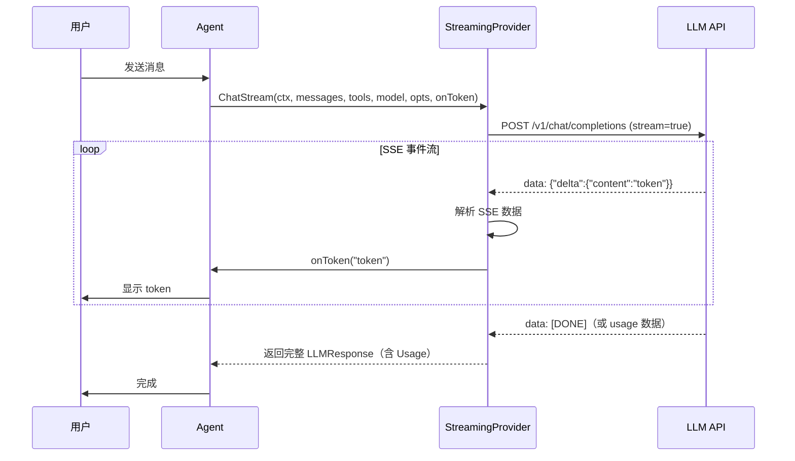
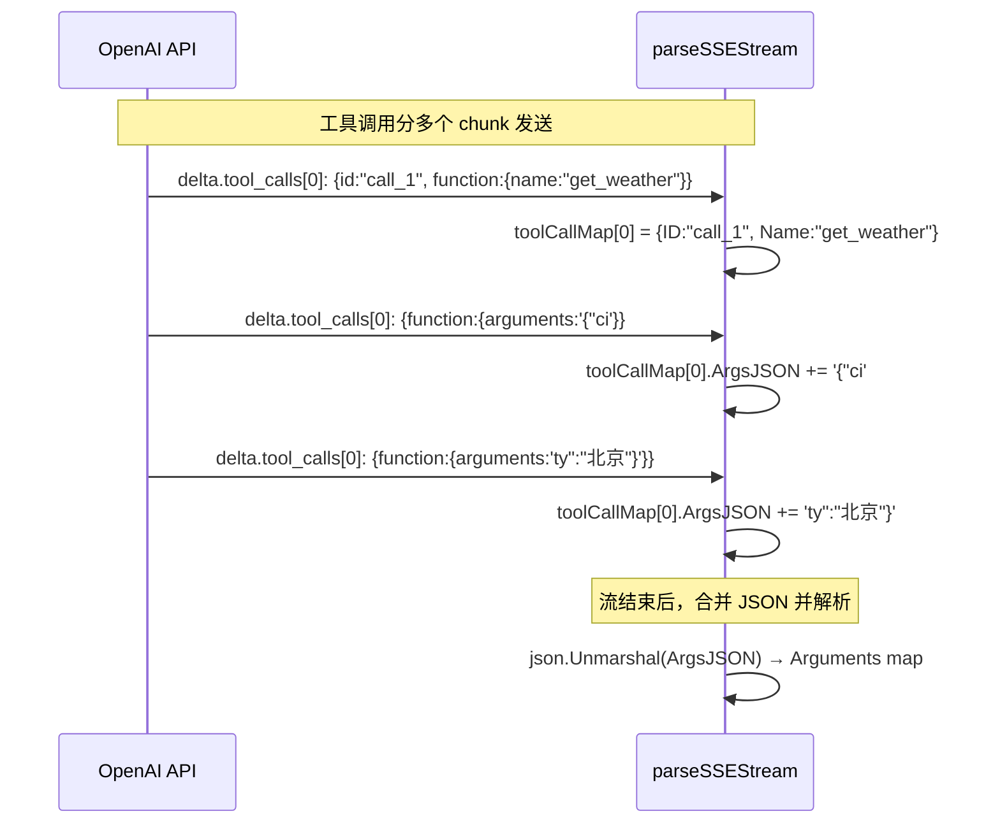
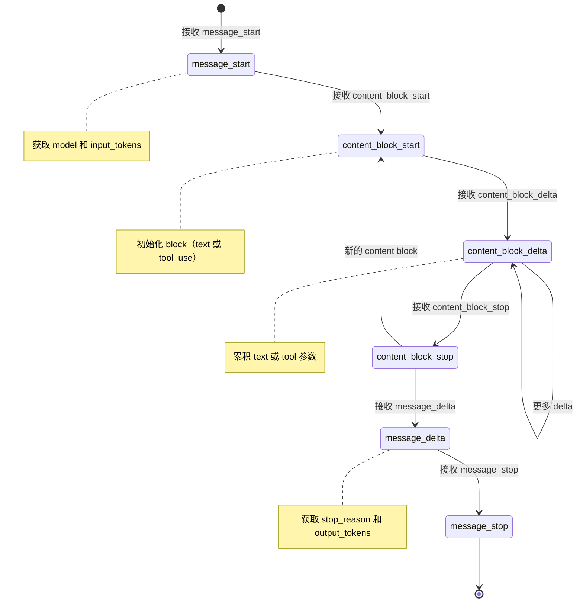
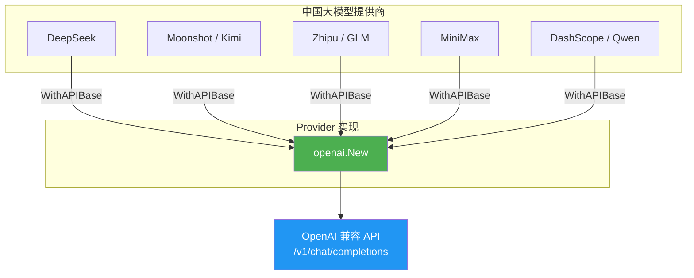

# 06 - 流式输出与中国大模型

本文档详细介绍 Golem Wave 2 新增的流式输出（Streaming）、中国大模型提供商集成、会话恢复（`-C` 标志）以及 Token 用量追踪系统。

## 目录

- [流式输出概述](#流式输出概述)
- [StreamingProvider 接口设计](#streamingprovider-接口设计)
- [OpenAI SSE 实现](#openai-sse-实现)
- [Anthropic SSE 实现](#anthropic-sse-实现)
- [中国大模型提供商](#中国大模型提供商)
- [会话恢复 (-C 标志)](#会话恢复--c-标志)
- [Token 用量追踪](#token-用量追踪)
- [配置示例](#配置示例)
- [小结](#小结)

## 流式输出概述

### 为什么需要流式输出？

传统的 LLM 调用是**阻塞式**的：发送请求 → 等待完整响应 → 一次性返回。对于长回答，用户可能需要等待数秒甚至十几秒才能看到第一个字。

**流式输出**（Streaming）解决了这个问题：LLM 生成的每个 token 会立即推送给客户端，用户可以实时看到回答逐字出现，体验类似 ChatGPT 的"打字机"效果。

### SSE 协议基础

流式输出基于 **Server-Sent Events**（SSE）协议，这是 HTTP 的标准扩展：

- 客户端发送普通 HTTP POST 请求
- 服务端返回 `Content-Type: text/event-stream`
- 服务端以 `data: {...}\n\n` 格式逐行发送事件
- 每个事件包含一个 JSON 数据块（chunk）
- 流结束时发送特殊标记

```
data: {"choices":[{"delta":{"content":"你"}}]}

data: {"choices":[{"delta":{"content":"好"}}]}

data: {"choices":[{"delta":{"content":"！"}}]}

data: [DONE]
```

### 流式输出架构



## StreamingProvider 接口设计

Wave 2 引入了 `StreamingProvider` 可选接口，定义在 `core/providers/types.go`：

```go
// StreamingProvider 是一个可选接口，支持 token-by-token 流式输出。
// 使用 Go 类型断言检查 Provider 是否支持流式：
//
//   if sp, ok := provider.(StreamingProvider); ok {
//       resp, err := sp.ChatStream(ctx, msgs, tools, model, opts, onToken)
//   }
type StreamingProvider interface {
    LLMProvider

    // ChatStream 发送消息并逐 token 流式返回响应。
    // onToken 在每个文本 delta 到达时被调用。
    // 流式结束后返回完整的 LLMResponse（包含 Usage）。
    ChatStream(ctx context.Context, messages []Message, toolDefs []tools.ToolDefinition,
        model string, opts *ChatOptions, onToken func(token string)) (*LLMResponse, error)
}
```

### 设计要点

1. **可选接口**：`StreamingProvider` 嵌入了 `LLMProvider`，不是所有 Provider 都必须实现。使用 Go 的类型断言模式来检测支持。

2. **回调模式**：`onToken func(token string)` 参数是一个回调函数，每收到一个 token 就调用一次。调用者可以自由决定如何处理（打印到终端、通过 WebSocket 推送等）。

3. **最终返回完整响应**：`ChatStream` 返回的 `*LLMResponse` 包含完整内容和 Usage 信息，方便后续处理和 Token 统计。

4. **编译时类型检查**：每个实现 `StreamingProvider` 的 Provider 都有编译时检查：

```go
// openai/openai.go
var _ providers.StreamingProvider = (*Provider)(nil)

// anthropic/anthropic.go
var _ providers.StreamingProvider = (*Provider)(nil)
```

### 使用示例

```go
// 在 Agent 中检测并使用流式输出
provider, modelName, err := factory.GetProviderForModel("openai/gpt-4o")
if err != nil {
    return err
}

// 检查是否支持流式
if sp, ok := provider.(providers.StreamingProvider); ok {
    // 支持流式 → 使用 ChatStream
    resp, err := sp.ChatStream(ctx, messages, toolDefs, modelName, opts,
        func(token string) {
            fmt.Print(token) // 实时输出每个 token
        })
    if err != nil {
        return err
    }
    // resp.Usage 包含完整的 Token 使用统计
    fmt.Printf("\n[tokens: %d]\n", resp.Usage.TotalTokens)
} else {
    // 不支持流式 → 回退到普通 Chat
    resp, err := provider.Chat(ctx, messages, toolDefs, modelName, opts)
    // ...
}
```

## OpenAI SSE 实现

OpenAI 的流式输出实现位于 `core/providers/openai/openai.go` 的 `ChatStream()` 和 `parseSSEStream()` 方法。

### 请求构造

```go
func (p *Provider) ChatStream(
    ctx context.Context,
    messages []providers.Message,
    toolDefs []tools.ToolDefinition,
    model string,
    opts *providers.ChatOptions,
    onToken func(token string),
) (*providers.LLMResponse, error) {
    reqBody := p.buildRequest(messages, toolDefs, model, opts)
    reqBody["stream"] = true
    reqBody["stream_options"] = map[string]interface{}{"include_usage": true}
    // ...
}
```

关键点：
- `"stream": true` 启用流式输出
- `"stream_options": {"include_usage": true}` 让 OpenAI 在最终 chunk 中包含 Usage 信息

### SSE 数据格式

OpenAI 的 SSE 格式如下：

```
data: {"model":"gpt-4o","choices":[{"index":0,"delta":{"role":"assistant","content":""},"finish_reason":null}]}

data: {"model":"gpt-4o","choices":[{"index":0,"delta":{"content":"你好"},"finish_reason":null}]}

data: {"model":"gpt-4o","choices":[{"index":0,"delta":{"content":"！"},"finish_reason":"stop"}]}

data: {"model":"gpt-4o","choices":[],"usage":{"prompt_tokens":10,"completion_tokens":5,"total_tokens":15}}

data: [DONE]
```

### parseSSEStream 解析逻辑

```go
func (p *Provider) parseSSEStream(body io.Reader, onToken func(token string)) (*providers.LLMResponse, error) {
    scanner := bufio.NewScanner(body)
    // ...

    for scanner.Scan() {
        line := scanner.Text()

        // 跳过空行和非数据行
        if !strings.HasPrefix(line, "data: ") {
            continue
        }
        data := strings.TrimPrefix(line, "data: ")

        // 流结束标记
        if data == "[DONE]" {
            break
        }

        // 解析 JSON chunk
        var chunk struct { /* ... */ }
        json.Unmarshal([]byte(data), &chunk)

        // 文本内容 → 追加 + 回调
        if choice.Delta.Content != "" {
            contentBuilder.WriteString(choice.Delta.Content)
            if onToken != nil {
                onToken(choice.Delta.Content)
            }
        }

        // 工具调用 → 按 index 累积
        for _, tc := range choice.Delta.ToolCalls {
            // 按 index 分组，逐步累积 ID、Name、Arguments
        }

        // Usage → 最终 chunk 中获取
        if chunk.Usage != nil {
            usage = providers.TokenUsage{...}
        }
    }
}
```

### 工具调用累积

OpenAI 的流式工具调用比较特殊：参数（`arguments`）会分多个 chunk 发送，需要按 `index` 分组累积：



## Anthropic SSE 实现

Anthropic 的流式实现位于 `core/providers/anthropic/anthropic.go` 的 `ChatStream()` 和 `parseAnthropicSSE()` 方法。

### 与 OpenAI 的区别

Anthropic 使用**事件驱动**的 SSE 格式，每个数据块前有一个 `event:` 行标明事件类型：

```
event: message_start
data: {"type":"message_start","message":{"model":"claude-3-opus","usage":{"input_tokens":25}}}

event: content_block_start
data: {"type":"content_block_start","index":0,"content_block":{"type":"text"}}

event: content_block_delta
data: {"type":"content_block_delta","index":0,"delta":{"type":"text_delta","text":"你好"}}

event: content_block_delta
data: {"type":"content_block_delta","index":0,"delta":{"type":"text_delta","text":"！"}}

event: content_block_stop
data: {"type":"content_block_stop","index":0}

event: message_delta
data: {"type":"message_delta","delta":{"stop_reason":"end_turn"},"usage":{"output_tokens":10}}

event: message_stop
data: {"type":"message_stop"}
```

### 事件状态机

Anthropic SSE 解析是一个**状态机**，根据事件类型分发处理：



### 核心解析逻辑

```go
func (p *Provider) parseAnthropicSSE(body io.Reader, onToken func(token string)) (*providers.LLMResponse, error) {
    var pendingEvent string

    for scanner.Scan() {
        line := scanner.Text()

        // 捕获事件类型
        if strings.HasPrefix(line, "event: ") {
            pendingEvent = strings.TrimPrefix(line, "event: ")
            continue
        }

        // 根据事件类型分发处理
        switch pendingEvent {
        case "message_start":
            // 提取 model 和 input_tokens
        case "content_block_start":
            // 初始化新的内容块（text 或 tool_use）
        case "content_block_delta":
            // text_delta → 追加文本 + 回调 onToken
            // input_json_delta → 累积工具参数 JSON
        case "message_delta":
            // 提取 stop_reason 和 output_tokens
        }
    }
}
```

### Usage 分拆

Anthropic 的 Usage 信息分在两个事件中：
- `message_start`：包含 `input_tokens`（输入 Token 数）
- `message_delta`：包含 `output_tokens`（输出 Token 数）

需要在解析完所有事件后合并计算 `TotalTokens = input_tokens + output_tokens`。

### stop_reason 映射

Anthropic 的 stop_reason 与统一格式不同，需要映射：

| Anthropic | 统一格式 | 含义 |
|-----------|----------|------|
| `end_turn` | `stop` | 正常结束 |
| `tool_use` | `tool_calls` | 需要执行工具 |
| `max_tokens` | `length` | 达到最大 Token 限制 |

## 中国大模型提供商

Wave 2 新增了 5 个中国大模型提供商。一个关键发现是：**这些提供商全部使用 OpenAI 兼容 API 格式**，因此我们可以直接复用 `openai.New()` 加 `WithAPIBase()` 来注册。

### 提供商列表

| 提供商 | Vendor 前缀 | 默认 API Base | 环境变量 | 示例模型 |
|--------|-------------|---------------|----------|----------|
| DeepSeek | `deepseek` | `https://api.deepseek.com` | `DEEPSEEK_API_KEY` | `deepseek-chat`, `deepseek-reasoner` |
| Kimi (月之暗面) | `moonshot` | `https://api.moonshot.cn` | `MOONSHOT_API_KEY` | `moonshot-v1-8k`, `moonshot-v1-32k`, `moonshot-v1-128k` |
| 智谱 GLM | `zhipu` | `https://open.bigmodel.cn/api/paas` | `ZHIPU_API_KEY` | `glm-4`, `glm-4-flash`, `glm-4-plus` |
| MiniMax | `minimax` | `https://api.minimax.chat` | `MINIMAX_API_KEY` | `MiniMax-Text-01`, `abab6.5s-chat` |
| 通义千问 (Qwen) | `dashscope` | `https://dashscope.aliyuncs.com/compatible-mode` | `DASHSCOPE_API_KEY` | `qwen-plus`, `qwen-turbo`, `qwen-max` |

### 架构图



### 注册代码

参见 `cmd/golem/main.go` 中的 `registerProviders()`：

```go
func registerProviders(cfg *config.Config) *providers.Factory {
    factory := providers.NewFactory()
    registered := make(map[string]bool)

    for _, entry := range cfg.ModelList {
        vendor := entry.Vendor()
        if registered[vendor] {
            continue
        }
        registered[vendor] = true

        switch vendor {
        case "openai":
            // 标准 OpenAI
            factory.Register(vendor, openai.New(entry.APIKey, opts...))
        case "anthropic":
            // 标准 Anthropic（独立实现）
            factory.Register(vendor, anthropic.New(entry.APIKey, opts...))

        // 中国大模型 — 全部复用 openai.New + WithAPIBase
        case "deepseek":
            base := entry.APIBase
            if base == "" {
                base = "https://api.deepseek.com"
            }
            factory.Register(vendor, openai.New(entry.APIKey, openai.WithAPIBase(base)))

        case "moonshot": // Kimi
            base := entry.APIBase
            if base == "" {
                base = "https://api.moonshot.cn"
            }
            factory.Register(vendor, openai.New(entry.APIKey, openai.WithAPIBase(base)))

        // zhipu, minimax, dashscope 同理...
        }
    }
    return factory
}
```

### 为什么能复用 OpenAI Provider？

中国大模型提供商普遍采用 OpenAI 兼容 API，即：

1. **请求格式相同**：`POST /v1/chat/completions`，JSON Body 中包含 `model`、`messages`、`tools` 等字段
2. **响应格式相同**：`choices[0].message.content`、`choices[0].message.tool_calls` 等
3. **SSE 流式格式相同**：`data: {...}` + `data: [DONE]`
4. **认证方式相同**：`Authorization: Bearer <api-key>`

唯一的区别是 **API Base URL** 不同，所以只需要 `openai.WithAPIBase()` 即可。

## 会话恢复 (-C 标志)

Wave 2 新增了 `-C` / `--continue` 标志，支持恢复之前的对话会话。

### 使用方式

```bash
# 恢复最近的会话
golem agent -C last

# 恢复指定会话 ID
golem agent -C "550e8400-e29b-41d4-a716-446655440000"

# 组合使用：恢复会话 + 发送新消息
golem agent -C last -m "继续上次的话题"
```

### resolveSessionID 函数

参见 `cmd/golem/main.go`：

```go
func resolveSessionID(store session.SessionStore, flag string) (string, error) {
    // 非 "last" → 直接查找指定 ID
    if flag != "last" {
        if _, ok := store.Get(flag); !ok {
            return "", fmt.Errorf("session %q not found", flag)
        }
        return flag, nil
    }

    // "last" → 找到最近更新的会话
    sessions := store.List()
    if len(sessions) == 0 {
        return "", fmt.Errorf("no sessions to resume")
    }
    latest := sessions[0]
    for _, s := range sessions[1:] {
        if s.UpdatedAt.After(latest.UpdatedAt) {
            latest = s
        }
    }
    return latest.ID, nil
}
```

### 工作流程

```mermaid
flowchart TD
    A["-C 标志值"] --> B{是 "last"?}
    B -->|是| C[获取所有会话列表]
    C --> D{列表为空?}
    D -->|是| E[返回错误：no sessions]
    D -->|否| F[按 UpdatedAt 找最新]
    F --> G[返回最新会话 ID]

    B -->|否| H[按 ID 查找会话]
    H --> I{会话存在?}
    I -->|是| J[返回该会话 ID]
    I -->|否| K[返回错误：not found]

    G --> L[传入 runAgentOneShot/Interactive]
    J --> L
    L --> M[Agent 加载历史消息继续对话]
```

### 集成到 Agent 命令

```go
func newAgentCommand() *cobra.Command {
    // ...
    RunE: func(cmd *cobra.Command, args []string) error {
        continueFlag, _ := cmd.Flags().GetString("continue")
        // ...

        var sessionID string
        if continueFlag != "" {
            sessionID, err = resolveSessionID(sessionStore, continueFlag)
            if err != nil {
                return err
            }
            log.Info("resuming session", "id", sessionID)
        }

        // 传递给 one-shot 或 interactive 模式
        if message != "" {
            return runAgentOneShot(ag, b, message, sessionID)
        }
        return runAgentInteractive(ag, b, sessionID)
    }
}
```

## Token 用量追踪

Wave 2 新增了 `core/usage/` 包，用于追踪和统计 Token 消耗及成本。

### 包结构

```
core/usage/
├── tracker.go       # Tracker、SessionUsage、NewTracker()、Record()、GetSession()、GetTotal()
├── pricing.go       # ModelPricing、GetPricing()、defaultPricing（25+ 模型定价表）
└── tracker_test.go  # 7 个测试
```

### Tracker 核心类型

```go
// TokenUsage 记录单次请求的 Token 使用
type TokenUsage struct {
    PromptTokens     int
    CompletionTokens int
    TotalTokens      int
}

// Tracker 管理所有会话的 Token 使用统计
type Tracker struct {
    mu       sync.Mutex
    sessions map[string]*SessionUsage
}

// SessionUsage 记录单个会话的累计统计
type SessionUsage struct {
    Model            string
    PromptTokens     int
    CompletionTokens int
    TotalTokens      int
    Requests         int
    EstimatedCostUSD float64
}
```

### 定价系统

`pricing.go` 内置了 25+ 个模型的定价表，使用"每百万 Token 价格"换算：

```go
// 每百万 Token 转每 Token 价格
func ppm(usdPerMillion float64) float64 {
    return usdPerMillion / 1_000_000
}

var defaultPricing = map[string]ModelPricing{
    // OpenAI
    "gpt-4o":      {InputPerToken: ppm(2.50), OutputPerToken: ppm(10.00)},
    "gpt-4o-mini": {InputPerToken: ppm(0.15), OutputPerToken: ppm(0.60)},

    // Anthropic
    "claude-sonnet-4-20250514":   {InputPerToken: ppm(3.00), OutputPerToken: ppm(15.00)},

    // DeepSeek
    "deepseek-chat":     {InputPerToken: ppm(0.27), OutputPerToken: ppm(1.10)},

    // Moonshot (Kimi)
    "moonshot-v1-8k":   {InputPerToken: ppm(1.00), OutputPerToken: ppm(1.00)},

    // Zhipu (GLM)
    "glm-4":       {InputPerToken: ppm(1.00), OutputPerToken: ppm(1.00)},

    // MiniMax
    "MiniMax-Text-01": {InputPerToken: ppm(1.00), OutputPerToken: ppm(1.00)},

    // DashScope (Qwen)
    "qwen-plus":    {InputPerToken: ppm(0.80), OutputPerToken: ppm(2.00)},
    // ... 共 25+ 个模型
}
```

### GetPricing 查找逻辑

```go
func GetPricing(model string) ModelPricing {
    // 精确匹配
    if p, ok := defaultPricing[model]; ok {
        return p
    }
    // 大小写不敏感匹配
    lower := strings.ToLower(model)
    for k, v := range defaultPricing {
        if strings.ToLower(k) == lower {
            return v
        }
    }
    // 未知模型返回零价格
    return zeroPricing
}
```

### 用量显示

`cmd/golem/main.go` 中的 `printUsage()` 函数将 Token 统计输出到 stderr（不污染 stdout 管道输出）：

```go
func printUsage(u *bus.TokenUsage) {
    if u == nil {
        return
    }
    fmt.Fprintf(os.Stderr, "\n[tokens: %d prompt + %d completion = %d total]",
        u.PromptTokens, u.CompletionTokens, u.TotalTokens)
}
```

输出效果：

```
北京今天天气晴朗，温度 15°C，适合户外活动。
[tokens: 150 prompt + 30 completion = 180 total]
```

## 配置示例

以下是包含所有提供商的配置文件格式（`config/config.example.json`）：

```json
{
  "model_list": [
    {
      "model_name": "openai/gpt-4o",
      "api_key": "${OPENAI_API_KEY}"
    },
    {
      "model_name": "anthropic/claude-sonnet-4-20250514",
      "api_key": "${ANTHROPIC_API_KEY}"
    },
    {
      "model_name": "deepseek/deepseek-chat",
      "api_key": "${DEEPSEEK_API_KEY}"
    },
    {
      "model_name": "moonshot/moonshot-v1-8k",
      "api_key": "${MOONSHOT_API_KEY}"
    },
    {
      "model_name": "zhipu/glm-4",
      "api_key": "${ZHIPU_API_KEY}"
    },
    {
      "model_name": "minimax/MiniMax-Text-01",
      "api_key": "${MINIMAX_API_KEY}"
    },
    {
      "model_name": "dashscope/qwen-plus",
      "api_key": "${DASHSCOPE_API_KEY}"
    }
  ],
  "agents": {
    "defaults": {
      "model_name": "openai/gpt-4o",
      "max_tokens": 4096,
      "max_iterations": 10
    }
  }
}
```

使用 `-M` 标志可以在运行时切换模型：

```bash
# 使用 DeepSeek
golem agent -M deepseek/deepseek-chat -m "你好"

# 使用 Kimi
golem agent -M moonshot/moonshot-v1-128k -m "帮我总结这段文字"

# 使用 GLM
golem agent -M zhipu/glm-4 -m "写一首诗"
```

## 小结

本章介绍了 Wave 2 的四大新功能：

**核心要点**：

1. **StreamingProvider 接口**：可选的流式接口，通过 Go 类型断言检测支持，使用 `onToken` 回调模式
2. **OpenAI SSE**：`data: {...}` 格式，工具调用按 index 累积，`stream_options` 获取 Usage
3. **Anthropic SSE**：事件驱动状态机，Usage 分在 `message_start` 和 `message_delta` 两个事件中
4. **中国大模型**：5 个国内提供商全部复用 OpenAI 兼容格式，只需 `WithAPIBase()` 即可接入
5. **会话恢复**：`-C last` 恢复最近会话，`-C <id>` 恢复指定会话
6. **Token 用量**：内置 25+ 模型定价表，实时计算成本，输出到 stderr 不污染管道

**实践建议**：

- 优先使用流式输出提升用户体验
- 中国大模型是高性价比选择（如 DeepSeek Chat 仅 $0.27/M 输入 Token）
- 使用 `-C last` 继续之前的对话，避免重复上下文
- 关注 Token 用量显示，优化 prompt 控制成本

👉 [上一章：消息总线](./05-message-bus.md)
