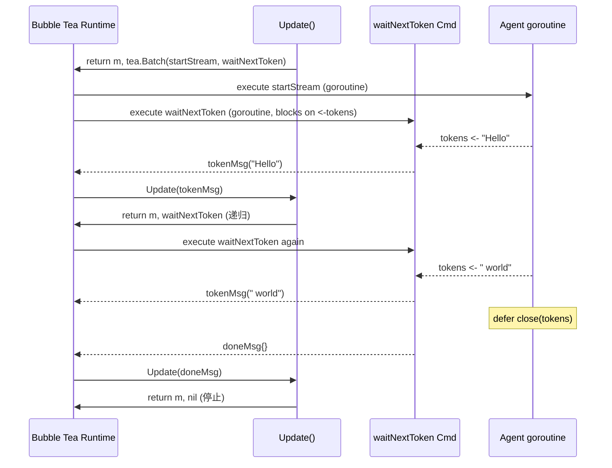

# 07 - TUI Channel 与 init 向导

本文档介绍 Golem Wave 3 新增的 Bubble Tea TUI（终端 UI）以及 `init` 一键配置向导。这是整个学习系列的最后一章，涵盖 Elm 架构在 Go 中的应用、TUI 与流式输出的结合，以及如何为 Termux/Android 环境设计兼容性方案。

## 目录

- [为什么需要 TUI Channel？](#为什么需要-tui-channel)
- [Bubble Tea 架构：Elm 模型](#bubble-tea-架构elm-模型)
- [为什么 TUI 要独立成 internal/channels/tui/](#为什么-tui-要独立成-internalchannelstui)
- [Model 结构体详解](#model-结构体详解)
- [tokenCh 的设计：channel 而非 callback](#tokench-的设计channel-而非-callback)
- [startStream + waitNextToken：递归 Cmd 链](#startstream--waitnexttokenrecursive-cmd-链)
- [KeyEnter 处理流程：tea.Batch 并发 Cmd](#keyenter-处理流程teabatch-并发-cmd)
- [View() 渲染逻辑](#view-渲染逻辑)
- [TTY 检测与 TUI 自动激活](#tty-检测与-tui-自动激活)
- [Termux 兼容性决策](#termux-兼容性决策)
- [init 向导设计](#init-向导设计)
- [测试策略](#测试策略)
- [小结](#小结)

---

## 为什么需要 TUI Channel？

CLI 模式（`internal/channels/cli/`）直接使用 `bufio.Scanner` 读取 stdin，输出到 stdout。这对管道（pipe）和脚本场景工作良好，但用于交互式对话时有几个明显缺陷：

1. **流式 token 无法"原地刷新"**：每个 token 都是 `fmt.Print`，换行后就固定了，无法实现 ChatGPT 那种"打字机"效果
2. **光标控制困难**：无法同时显示用户输入框和 AI 回复区域
3. **键盘事件处理粗糙**：只能整行读取，无法响应 Backspace、方向键等

Bubble Tea 是 Charm 出品的 Go TUI 框架，提供声明式、事件驱动的终端 UI 构建方式，完美解决上述问题。

---

## Bubble Tea 架构：Elm 模型

Bubble Tea 完全借鉴了 **Elm 架构**（The Elm Architecture，TEA），也叫 Model-View-Update 模式：

```
┌────────────────────────────────────────────┐
│              Bubble Tea Runtime            │
│                                            │
│  ┌──────────┐   msg    ┌──────────────┐   │
│  │          │ ───────► │              │   │
│  │  Update  │          │    Model     │   │
│  │(msg)→    │ ◄─────── │  (state)     │   │
│  │(Model,Cmd│  new     │              │   │
│  └──────────┘  model   └──────────────┘   │
│       │                       │            │
│       │ Cmd                   │            │
│       ▼                       ▼            │
│  ┌──────────┐            ┌──────────┐     │
│  │  Runtime │            │  View()  │     │
│  │ executes │            │ → string │     │
│  │   Cmd,   │            │ (render) │     │
│  │ emits msg│            └──────────┘     │
│  └──────────┘                             │
└────────────────────────────────────────────┘
```

三个核心概念：

| 概念 | 类型 | 职责 |
|------|------|------|
| **Model** | struct | 应用的全部状态（immutable value，每次更新返回新值） |
| **Update** | `func(msg) → (Model, Cmd)` | 接收事件，计算新状态，返回副作用命令 |
| **View** | `func() → string` | 根据当前 Model 渲染字符串，框架负责刷新到终端 |

**Cmd**（命令）是 Bubble Tea 对副作用的建模：它是一个 `func() tea.Msg`，由运行时在 goroutine 中执行，完成后将结果作为新的 `msg` 投入事件循环。这样 `Update` 函数自身保持**纯函数**，所有 I/O 都通过 `Cmd` 解耦。

---

## 为什么 TUI 要独立成 internal/channels/tui/

Bubble Tea 是一个**侵入性较强的框架**：它接管 stdin/stdout/stderr，控制原始终端模式（raw mode），并运行自己的事件循环。如果多个包都能 import 它，可能产生以下问题：

1. **循环依赖**：`core/agent` 如果直接依赖 Bubble Tea，就把 UI 框架嵌入了业务层
2. **测试污染**：单元测试启动 Bubble Tea 程序会接管 TTY，破坏测试输出
3. **平台兼容性隔离**：Termux 的特殊处理（不使用鼠标模式等）应集中在一处

因此，**Bubble Tea 的 import 被严格限制在 `internal/channels/tui/` 内**。TUI 通过一个本地接口 `MessageHandler` 与外部通信：

```go
// internal/channels/tui/tui.go
type MessageHandler interface {
    HandleMessageStream(ctx context.Context, sessionID string, message string, tokens chan<- string) error
}
```

这与 `core/agent.MessageHandler` 接口的方法签名相同，但定义在 TUI 包内部，遵循"依赖倒置"原则——**TUI 定义它需要什么，而不是依赖 core 定义的什么**。

---

## Model 结构体详解

```go
type Model struct {
    agent     MessageHandler   // 与 Agent 通信的接口（依赖注入）
    sessionID string           // 当前会话 ID（来自外部）
    ctx       context.Context  // 可取消的 context（Ctrl+C 会 cancel 它）
    cancel    context.CancelFunc

    messages  []chatMsg        // 已渲染的对话历史（user + assistant 交替）
    tokenCh   <-chan string     // 当前 AI 回复的 token channel（nil=空闲）
    input     string           // 用户正在输入的文本（实时缓冲）
    thinking  bool             // true = AI 正在生成，禁止用户提交新消息
    lastError string           // 最近一次错误信息（显示在 View 中）
}
```

注意 `Model` 是**值类型（value type）**，而非指针。每次 `Update` 返回一个新的 `Model` 拷贝，这是 Elm 架构的核心——不可变状态使 Update 成为纯函数，也让调试和测试变得简单。

---

## tokenCh 的设计：channel 而非 callback

流式 token 如何从 Agent 传递到 TUI？有两种常见方案：

**方案 A（callback）**：传入一个 `onToken func(string)` 回调函数
```go
// 在 onToken 里直接操作 Model — 不可行！
// Update 是值语义的，callback 拿不到最新的 Model
```

**方案 B（channel）**：传入 `chan<- string`，TUI 自己消费

```go
tokens := make(chan string, 64)
m.tokenCh = tokens  // 保存只读端
go agent.HandleMessageStream(ctx, sessionID, text, tokens)
// TUI 通过 waitNextToken 从 tokenCh 消费
```

选择 channel 的原因：
- Bubble Tea 的 `Cmd` 机制天然支持"等待 channel 返回值"的模式
- channel 是 Go 一等公民，生命周期清晰（`close(tokens)` = 流结束）
- 缓冲大小 64 防止 Agent 写入时因 TUI 渲染延迟而阻塞

---

## startStream + waitNextToken：recursive Cmd 链

这是整个 TUI 实现中最精妙的设计。

### startStream

```go
func (m Model) startStream(text string, tokens chan<- string) tea.Cmd {
    return func() tea.Msg {
        err := m.agent.HandleMessageStream(m.ctx, m.sessionID, text, tokens)
        if err != nil {
            return doneMsg{err: err}
        }
        return nil
    }
}
```

`startStream` 返回一个 `Cmd`（即 `func() tea.Msg`），运行时在独立 goroutine 执行它。这个 goroutine 会**阻塞**，直到 Agent 完成整个流式响应，然后：
- 如果有错误 → 返回 `doneMsg{err: err}`
- 否则 → 返回 `nil`（此时 channel 已被 `defer close(tokens)` 关闭，`waitNextToken` 会检测到）

### waitNextToken

```go
func waitNextToken(tokens <-chan string) tea.Cmd {
    if tokens == nil {
        return nil
    }
    return func() tea.Msg {
        tok, ok := <-tokens   // 阻塞等待一个 token 或 channel 关闭
        if !ok {
            return doneMsg{}  // channel 关闭 → 流结束
        }
        return tokenMsg(tok)  // 有新 token → 包装成消息返回
    }
}
```

关键在 `Update` 里处理 `tokenMsg` 的方式：

```go
case tokenMsg:
    // 拼接 token 到最后一条 assistant 消息
    m.messages[len(m.messages)-1].content += string(msg)
    return m, waitNextToken(m.tokenCh)  // ← 递归！再次等待下一个 token
```

每次收到 `tokenMsg`，Update 就再次返回 `waitNextToken`，这样就形成了一个**递归 Cmd 链**：

```
waitNextToken → tokenMsg → Update → waitNextToken → tokenMsg → ...
```

直到 channel 关闭，最后一次 `waitNextToken` 返回 `doneMsg{}`，Update 将 `m.thinking` 置为 `false`，循环终止。

这是 **Bubble Tea 消费 channel 的惯用模式**，不需要额外 goroutine 或定时器。



---

## KeyEnter 处理流程：tea.Batch 并发 Cmd

当用户按下 Enter 时：

```go
case tea.KeyEnter:
    if m.thinking || strings.TrimSpace(m.input) == "" {
        return m, nil  // 正在思考 or 空输入 → 忽略
    }
    text := m.input
    m.input = ""        // 清空输入框
    m.thinking = true   // 禁止重复提交
    m.lastError = ""

    m.messages = append(m.messages, chatMsg{role: roleUser, content: text})

    tokens := make(chan string, 64)
    m.tokenCh = tokens

    // tea.Batch 同时启动两个并发 Cmd
    return m, tea.Batch(
        m.startStream(text, tokens),  // Cmd1: Agent 流式响应（长时间运行）
        waitNextToken(tokens),         // Cmd2: 等待第一个 token
    )
```

`tea.Batch` 让两个 Cmd 同时启动：
- `startStream` 在后台与 Agent 通信（可能需要数秒）
- `waitNextToken` 立刻开始等待 channel，一旦 Agent 开始产生 token 就能即时渲染

如果只启动 `startStream` 而不启动 `waitNextToken`，那么 `startStream` 完成之前用户看不到任何 token——这会退化为非流式体验。`tea.Batch` 是实现"实时渲染"的关键。

---

## View() 渲染逻辑

```go
func (m Model) View() string {
    var b strings.Builder

    // 1. 渲染历史对话（user 蓝色加粗 / assistant 绿色）
    for _, msg := range m.messages {
        switch msg.role {
        case roleUser:
            b.WriteString(userStyle.Render("You: "))
            b.WriteString(msg.content)
        case roleAssistant:
            b.WriteString(assistantStyle.Render("AI:  "))
            b.WriteString(msg.content)
        }
        b.WriteString("\n")
    }

    // 2. 错误信息（红色）
    if m.lastError != "" {
        b.WriteString(errorStyle.Render(fmt.Sprintf("error: %s", m.lastError)))
        b.WriteString("\n")
    }

    // 3. 思考中指示器（AI 生成时显示省略号占位）
    if m.thinking {
        b.WriteString(promptStyle.Render("AI:  ") + "…\n")
    }

    // 4. 输入框（始终在底部）
    b.WriteString(promptStyle.Render("> "))
    b.WriteString(m.input)

    return b.String()
}
```

几个设计要点：
- **View 是纯函数**：只读 `m` 的状态，无副作用
- **流式 token 是 append 到 `m.messages` 的**：每次 `tokenMsg` 触发 `Update`，Bubble Tea 就重新调用 `View()`，整个终端刷新，用户看到逐渐增长的文本
- **`thinking` 时显示省略号**：在 AI 返回第一个 token 之前（或者 token 之间的间隙），让用户知道系统在工作
- **lipgloss 样式**：颜色编码（用户=青色，AI=绿色，错误=红色）增强可读性，同时保持 ANSI 兼容（终端降级时自动丢弃颜色码）

---

## TTY 检测与 TUI 自动激活

TUI 并非总是合适的。在以下场景中，TUI 应该**不激活**：
- 通过管道传入输入（`echo "hello" | golem agent`）
- 在 CI/CD 脚本中运行
- 通过 SSH 或受限 TTY 运行

`foundation/term/detect.go` 提供了 TTY 检测原语：

```go
var (
    // sync.OnceValue: 只检测一次，结果缓存，线程安全
    IsInputTTY = sync.OnceValue(func() bool {
        return isatty.IsTerminal(os.Stdin.Fd()) || isatty.IsCygwinTerminal(os.Stdin.Fd())
    })

    IsOutputTTY = sync.OnceValue(func() bool {
        return isatty.IsTerminal(os.Stdout.Fd()) || isatty.IsCygwinTerminal(os.Stdout.Fd())
    })
)
```

使用 `sync.OnceValue` 的理由：
1. TTY 状态在进程生命周期内不变，缓存避免重复 syscall
2. 线程安全，可在任何 goroutine 调用
3. 返回函数（而非直接变量），意图清晰：这是"惰性初始化的计算值"

`main.go` 中的 TUI 激活逻辑：

```go
// 步骤 1: 如果 stdin 不是 TTY，读取管道内容作为消息
if !term.IsInputTTY() {
    stdinContent, _ := term.ReadStdin()
    // ... 追加到 message
}

// 步骤 2: 如果有显式 -m 消息，直接 one-shot 模式
if message != "" {
    return runAgentOneShot(ag, b, message, sessionID)
}

// 步骤 3: stdin 不是 TTY 但没有 -m → 报错
if !term.IsInputTTY() {
    return fmt.Errorf("no input: use -m flag or pipe content via stdin")
}

// 步骤 4: stdin 是 TTY，且没有 --no-tui → 启动 TUI
if !noTUI {
    return tui.Run(ctx, sessionID, ag)
}

// 步骤 5: --no-tui 强制使用 CLI 模式
return runAgentInteractive(ag, b, sessionID)
```

这个决策树保证了：
- **管道/脚本** → one-shot 或报错（不打开 TUI）
- **交互式 TTY + 默认** → TUI（最佳体验）
- **交互式 TTY + --no-tui** → CLI（调试或简单终端）

---

## Termux 兼容性决策

Termux 是 Android 上的 Linux 终端模拟器，TUI 在其上运行时有几个特殊约束：

### 1. 使用 tea.WithContext(ctx)，不使用鼠标模式选项

```go
// internal/channels/tui/tui.go
p := tea.NewProgram(m, tea.WithContext(ctx))
```

**为什么不传鼠标选项**：Bubble Tea v1.3.10 中不存在 `WithoutMouseCellMotion`（这是高版本的 API）。默认不传鼠标选项是正确的行为，在 Termux 下鼠标事件本来就不常用。

**为什么必须用 tea.WithContext(ctx)**：Termux 上 `os.Interrupt`（Ctrl+C）的信号传递路径与标准 Linux 有差异。通过 `ctx` 传递取消信号比依赖信号处理更可靠。

### 2. 不使用 Alt+key 快捷键

Termux 的键盘实现（尤其是外接蓝牙键盘）对 Alt+key 序列的处理不一致，某些组合会发送错误的字节序列。因此 TUI 的所有操作只使用：
- 普通字符按键（打字）
- `Enter`（提交）
- `Backspace`（删除字符）
- `Ctrl+C` / `Esc`（退出）
- `q`（空输入 + 非思考状态时退出）

### 3. 构建标志

```bash
CGO_ENABLED=0 go build -ldflags "-s -w" -trimpath -o build/golem ./cmd/golem
```

`CGO_ENABLED=0` 确保产出纯静态二进制，可直接复制到任何 Android/Termux 环境运行，无需 libc 版本匹配。

---

## init 向导设计

`cmd/golem/onboard.go` 实现了 `golem init` 首次配置向导。

### providerPresets：7 个预设

```go
var providerPresets = []providerPreset{
    {"OpenAI (GPT-4o)",              "openai",     "",                                           "openai/gpt-4o"},
    {"Anthropic (Claude 3.5 Sonnet)","anthropic",  "",                                           "anthropic/claude-3-5-sonnet-20241022"},
    {"DeepSeek",                     "deepseek",   "https://api.deepseek.com",                   "deepseek/deepseek-chat"},
    {"Moonshot (Kimi)",              "moonshot",   "https://api.moonshot.cn",                    "moonshot/moonshot-v1-8k"},
    {"Zhipu (GLM)",                  "zhipu",      "https://open.bigmodel.cn/api/paas",          "zhipu/glm-4"},
    {"MiniMax",                      "minimax",    "https://api.minimax.chat",                   "minimax/abab6.5s-chat"},
    {"DashScope (Qwen)",             "dashscope",  "https://dashscope.aliyuncs.com/compatible-mode","dashscope/qwen-turbo"},
}
```

OpenAI 和 Anthropic 的 `apiBase` 为空字符串——因为它们的 SDK 已内置默认值。中国大模型都需要指定 `apiBase`，因为它们复用 `openai.New()` 适配器（OpenAI 兼容协议）但 endpoint 不同。

### 为什么用 bufio.Reader 而非 fmt.Scan

```go
r := bufio.NewReader(os.Stdin)
line, err := r.ReadString('\n')
```

`fmt.Scan` / `fmt.Scanf` 以空白字符为分隔符，API key 中如果含有空格（少见但可能）会被截断。`bufio.Reader.ReadString('\n')` 读取整行（直到换行），行内任何字符都原样保留，更健壮。

### 配置文件格式

向导生成的配置写入 `~/.golem/config.json`，文件权限 0600（仅 owner 可读写）。向导不会修改任何环境变量，密钥只存在于本地文件中。

---

## 测试策略

TUI 测试面临一个核心困难：**不能在单元测试中启动真实的 Bubble Tea 程序**（它会接管 TTY，破坏测试框架的输出捕获）。

解决方案：直接调用 `Model.Update(msg)` 测试逻辑，完全绕过运行时：

```go
// internal/channels/tui/tui_test.go（伪代码示意）
func TestUpdateKeyEnter(t *testing.T) {
    m := New(context.Background(), "test-session", mockHandler)
    m.input = "hello"

    newModel, cmd := m.Update(tea.KeyMsg{Type: tea.KeyEnter})

    m2 := newModel.(Model)
    assert.True(t, m2.thinking)
    assert.Equal(t, "", m2.input)
    assert.NotNil(t, cmd)  // 应该有 Cmd（tea.Batch）
}
```

由于 `Model` 是值类型、`Update` 是纯函数（副作用封装在 `Cmd` 里），这种测试方式完全可行：
- 不需要真实终端
- 可以构造任意 `tea.Msg`（KeyMsg、tokenMsg、doneMsg）
- 验证状态转换是否正确

对 `waitNextToken` 的测试：

```go
func TestWaitNextTokenClosed(t *testing.T) {
    ch := make(chan string)
    close(ch)

    cmd := waitNextToken(ch)
    msg := cmd()  // 执行 Cmd，应立即返回 doneMsg

    _, ok := msg.(doneMsg)
    assert.True(t, ok)
}
```

---

## 小结

Wave 3 为 Golem 带来了两个面向用户的重要功能：

| 功能 | 文件 | 核心技术 |
|------|------|----------|
| Bubble Tea TUI | `internal/channels/tui/tui.go` | Elm 架构、递归 Cmd 链、channel 消费 |
| init 向导 | `cmd/golem/onboard.go` | bufio.Reader、7 个 Provider 预设 |
| TTY 自动检测 | `foundation/term/detect.go` | sync.OnceValue、isatty |
| TUI 激活逻辑 | `cmd/golem/main.go` | 5 步决策树 |

**关键设计模式总结**：

1. **递归 Cmd 链**：在 Elm 架构中消费 channel 的惯用方式，不需要额外 goroutine
2. **tea.Batch 并发**：同时启动 `startStream` 和 `waitNextToken`，实现真正的实时流式渲染
3. **接口隔离**：TUI 定义自己的 `MessageHandler`，不直接依赖 `core/agent`
4. **值语义 Model**：让 Update 成为纯函数，简化测试和推理
5. **sync.OnceValue**：线程安全的惰性初始化，适合进程级别的一次性检测

---

**学习系列完结！** 你已经完整学习了 Golem 的全部核心架构：

```
01 架构总览 → 02 Agent ReAct 循环 → 03 工具系统
04 Provider 系统 → 05 消息总线 → 06 流式输出
→ 07 TUI Channel（本章）
```

下一步建议：
- 尝试添加一个新的 LLM Provider（参考 `AGENTS.md` § 11）
- 实现一个自定义工具（参考 `AGENTS.md` § 12）
- 阅读 `feature/` 下的进阶模块（MCP、RAG、Memory），了解生产级扩展方向
