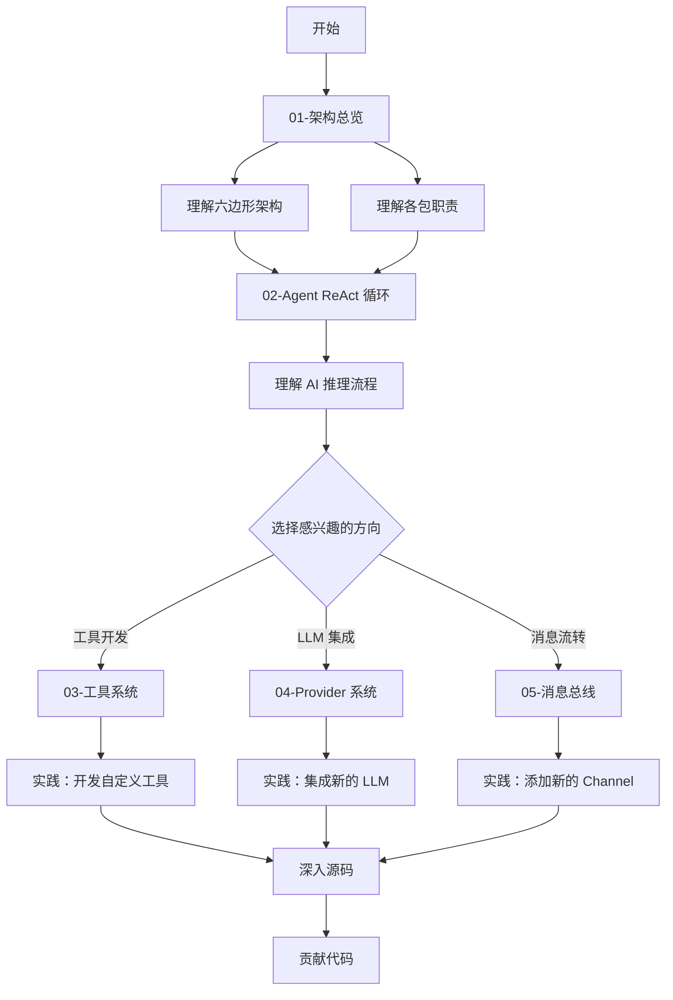

# unlimitedClaw 学习指南

欢迎来到 unlimitedClaw 项目学习指南！本指南旨在帮助中级 Go 开发者深入理解 AI 助手的架构设计和实现细节。

## 项目概述

**unlimitedClaw** 是一个使用 Go 语言编写的 AI 助手项目，设计灵感来自于 PicoClaw (sipeed/picoclaw)。该项目采用六边形架构（Hexagonal Architecture）和依赖注入模式，展示了如何构建一个模块化、可测试、易于扩展的 AI 助手系统。

### 核心特性

- **ReAct 循环**：实现 Reason + Act 模式，让 AI 能够推理并调用工具
- **消息总线架构**：基于 Pub/Sub 模式解耦各组件
- **工具系统**：可扩展的工具注册和执行机制
- **Provider 抽象**：支持多种 LLM 提供商（OpenAI、Anthropic 等）
- **会话管理**：线程安全的对话状态管理
- **依赖注入**：清晰的依赖关系和可测试性

### 与 PicoClaw 的关系

PicoClaw 是一个 Python 实现的 AI 助手框架。unlimitedClaw 借鉴了其核心设计思想，但使用 Go 语言重新实现，并在架构上做了以下改进：

- 采用更严格的接口设计和类型系统
- 使用消息总线实现组件解耦
- 强调并发安全和线程安全
- 更清晰的分层架构

## 如何使用本指南

### 建议阅读顺序

我们建议按照以下顺序阅读文档，从宏观架构逐步深入到各个子系统：

1. **[架构总览](./01-architecture-overview.md)** - 了解整体架构和各包的职责
2. **[Agent ReAct 循环](./02-agent-react-loop.md)** - 理解 AI 推理和执行的核心流程
3. **[工具系统](./03-tool-system.md)** - 学习如何实现和注册工具
4. **[Provider 系统](./04-provider-system.md)** - 理解 LLM 提供商抽象层
5. **[消息总线](./05-message-bus.md)** - 掌握组件间通信机制

每个文档都包含：
- 设计思想和架构决策
- 核心代码解析
- Mermaid 架构图
- 实际代码示例

### 前置知识

在开始学习之前，建议您具备以下知识：

- **Go 基础**：熟悉 Go 语法、接口、goroutine、channel
- **并发编程**：理解互斥锁（Mutex）、读写锁（RWMutex）
- **设计模式**：了解依赖注入、工厂模式、观察者模式
- **AI 基础**：了解 LLM（大语言模型）、Tool Calling 概念

### 学习建议

1. **边读边实践**：建议打开项目代码，对照文档阅读源码
2. **运行测试**：每个包都有完善的测试，可以通过测试理解用法
3. **动手修改**：尝试实现自定义工具或 Provider，加深理解
4. **画图总结**：用自己的方式画出架构图，巩固理解

## 项目结构

```
unlimitedClaw/
├── cmd/                          # 应用程序入口点（composition root）
│   └── unlimitedclaw/            # CLI 主程序
├── pkg/                          # 公共包（可被外部引用）
│   ├── agent/                    # ReAct 循环核心逻辑
│   ├── bus/                      # 消息总线（Pub/Sub）
│   ├── tools/                    # 工具接口和注册表
│   ├── providers/                # LLM 提供商抽象
│   ├── session/                  # 会话管理
│   ├── channels/                 # I/O 适配器（CLI 等）
│   ├── config/                   # 配置管理
│   └── logger/                   # 结构化日志
├── internal/                     # 内部包（仅供本项目使用）
├── config/                       # 配置文件
├── docs/                         # 文档
│   └── study/                    # 本学习指南
└── scripts/                      # 构建和工具脚本
```

## 核心概念速览

### ReAct 模式

ReAct = **Rea**son + A**ct**，是一种让 AI 能够交替进行推理和行动的模式：

1. **Reason**：AI 分析问题，决定需要调用哪些工具
2. **Act**：执行工具，获取结果
3. **循环**：将工具结果反馈给 AI，继续推理，直到得出最终答案

### 六边形架构

也称为端口和适配器架构（Ports and Adapters），核心思想：

- **核心业务逻辑**（agent, session）不依赖外部系统
- **端口**（接口）定义核心与外部的交互契约
- **适配器**（channels, providers）实现端口，连接外部系统

### 消息总线

基于 Pub/Sub 模式的事件总线，解耦消息的发送者和接收者：

- **发布者**：不关心谁在监听，只负责发布消息
- **订阅者**：订阅感兴趣的主题，接收相关消息
- **优势**：组件之间零依赖，易于测试和扩展

## 快速开始

### 构建项目

```bash
cd /home/strin/go/src/devLearn/aiLab/goclaw/unlimitedClaw
go build -o build/unlimitedclaw ./cmd/unlimitedclaw
```

### 运行测试

```bash
# 运行所有测试
go test ./...

# 运行特定包的测试
go test ./pkg/bus/
go test ./pkg/tools/
```

### 查看帮助

```bash
./build/unlimitedclaw --help
./build/unlimitedclaw agent --help
```

## 学习路径图



## 扩展阅读

- **Go 并发模式**：[Go Concurrency Patterns](https://go.dev/blog/pipelines)
- **六边形架构**：[Hexagonal Architecture](https://alistair.cockburn.us/hexagonal-architecture/)
- **ReAct 论文**：[ReAct: Synergizing Reasoning and Acting in Language Models](https://arxiv.org/abs/2210.03629)

## 问题反馈

如果您在学习过程中遇到问题，或者发现文档错误，欢迎：

- 提交 Issue
- 提交 Pull Request
- 在团队内部讨论

## 贡献指南

欢迎为本学习指南贡献内容！您可以：

- 完善现有文档的说明
- 添加更多代码示例
- 补充常见问题解答
- 改进 Mermaid 图表

---

**开始您的学习之旅！** 👉 [01-架构总览](./01-architecture-overview.md)
